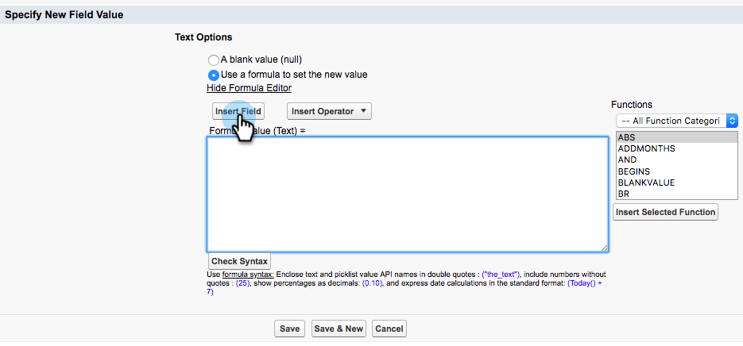

# Creating Workflow Rules in Salesforce {#creating-workflow-rules-in-salesforce}

Creating Workflow Rules in Salesforce - Marketo Docs - Product Documentation

When using Marketo Sales Insight (MSI) and Marketo Sales Connect (MSC) in parallel, the MSI Best Bets feature in Salesforce will not get updated. All other MSI features work as usual (viewing interesting moments in the iFrame, sending email, adding to campaigns, etc.). This article offers a workaround to get Best Bets working again.

>[!NOTE]
>
>This only impacts customers who are using **both** MSI and MSE, and who want to use the Best Bets feature in MSI. If you don’t need/use Best Bets, you can disregard.

#### Getting Started {#creatingworkflowrulesinsalesforce-gettingstarted}

The workaround includes creating new workflow rules to copy values from new MSE fields into the old MSI fields. You'll need to create four workflow rules for the Contact object and the same four workflow rules for the Lead object in your own Salesforce instance. This may require you to have CRM Admin rights (depending on your role and setup in the CRM).

Below are the recommended names of the workflow rules and description of each. These apply to the Contact and Lead object:

<table class="wrapped confluenceTable"> 
 <colgroup> 
  <col> 
  <col> 
 </colgroup> 
 <tbody> 
  <tr> 
   <td>Update Interesting Moment Desc Field</td> 
   <td>
Copy from: Last Marketo Engagement Desc Copy to: Last Interesting Moment Desc
</td> 
  </tr> 
  <tr> 
   <td>Update Interesting Moment Type field</td> 
   <td>
Copy from: Last Marketo Engagement Type Copy to: Last Interesting Moment Type
</td> 
  </tr> 
  <tr> 
   <td>Update Interesting Moment Source field</td> 
   <td>
Copy from: Last Marketo Engagement Source Copy to: Last Interesting Moment Source
</td> 
  </tr> 
  <tr> 
   <td>Update Interesting Moment Date field</td> 
   <td>
Copy from: Last Marketo Engagement Date Copy to: Last Interesting Moment Date
</td> 
  </tr> 
 </tbody> 
</table>

#### Instructions {#creatingworkflowrulesinsalesforce-instructions}

##### 1. After clicking Setup, search for Workflow and select Workflow Rules. {#creatingworkflowrulesinsalesforce-afterclickingsetup-searchforworkflowandselectworkflowrules.}

##### 2. Select New Rule. {#creatingworkflowrulesinsalesforce-selectnewrule.}

##### 3. Click the Object drop-down and select Lead, then click Next. {#creatingworkflowrulesinsalesforce-clicktheobjectdrop-downandselectlead-thenclicknext.}

##### 4. Enter “Update Interesting Moment Desc Field” as the Rule Name. Select the radio button created, and every time it’s edited. In the Rule Criteria drop-down select formula evaluates to true. Search for and select the ISCHANGED function. Then, highlight the default field value and click Insert Field. {#creatingworkflowrulesinsalesforce-enter“updateinterestingmomentdescfield”astherulename.selecttheradiobuttoncreated-andeverytimeit’sedited.intherulecriteriadrop-downselectformulaevaluatestotrue.searchforandselecttheischangedfunction.then-highlightthedefaul}

 

##### 5. In the “Insert Field” pop-up, choose Last Marketo Engagement Desc and click Insert. {#creatingworkflowrulesinsalesforce-inthe“insertfield”pop-up-chooselastmarketoengagementdescandclickinsert.}

##### 6. Click Save & Next. {#creatingworkflowrulesinsalesforce-clicksave&next.}

##### 7. In the Add Workflow Action drop-down, select New Field Update. {#creatingworkflowrulesinsalesforce-intheaddworkflowactiondrop-down-selectnewfieldupdate.}

##### 8. In the Name field, enter “Update Interesting Moment Desc Field” (Unique Name will auto-generate). In the Field to Update drop-down, choose Last Interesting Moment Desc. Select the Use a formula to set new value radio button, then click Show Formula Editor. {#creatingworkflowrulesinsalesforce-inthenamefield-enter“updateinterestingmomentdescfield”(uniquenamewillauto-generate).inthefieldtoupdatedrop-down-chooselastinterestingmomentdesc.selecttheuseaformulatosetnewvalueradiobutton-thenclickshowformulaeditor.}

##### 9. Click the Insert Field button. {#creatingworkflowrulesinsalesforce-clicktheinsertfieldbutton.}

##### 10. Select Last Marketo Engagement Desc, and click Insert. On the next page, click Save. {#creatingworkflowrulesinsalesforce-selectlastmarketoengagementdesc-andclickinsert.onthenextpage-clicksave.}

##### 11. Click Done. {#creatingworkflowrulesinsalesforce-clickdone.}

##### 12. Click Activate to turn on the workflow rule. {#creatingworkflowrulesinsalesforce-clickactivatetoturnontheworkflowrule.}

After the last step, you can choose to clone the workflow rule for the other fields listed in the Getting Started section: Desc, Type, Source, Date. After you complete the four workflow rules in the Contact object, repeat the same for the Lead object.
