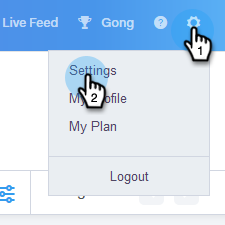
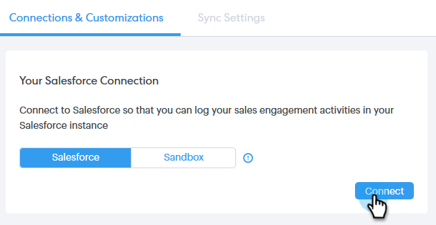

# Connect Your Sales Connect Account to Salesforce {#connect-your-sales-connect-account-to-salesforce}

Connect Your Sales Connect Account to Salesforce - Marketo Docs - Product Documentation

Follow these simple steps to connect Sales Connect to Salesforce.

### What's in this article? {#what-s-in-this-article}

[How to Connect as an Admin](#connectyoursalesconnectaccounttosalesforce-howtoconnectasanadmin)  
[How to Connect as a non-Admin](#connectyoursalesconnectaccounttosalesforce-howtoconnectasanon-admin)

#### How to Connect as an Admin {#connectyoursalesconnectaccounttosalesforce-howtoconnectasanadmin}

##### 1. In Sales Connect, click the gear icon on the upper-right and select Settings. {#connectyoursalesconnectaccounttosalesforce-insalesconnect-clickthegeariconontheupper-rightandselectsettings.}

##### 2. Under Admin Settings, click Salesforce. {#connectyoursalesconnectaccounttosalesforce-underadminsettings-clicksalesforce.}

##### 3. In the Connections & Customizations tab, click Connect. {#connectyoursalesconnectaccounttosalesforce-intheconnections&customizationstab-clickconnect.}

##### 4. Click OK. {#connectyoursalesconnectaccounttosalesforce-clickok.}

##### 5. If you’re already logged in to Salesforce, you'll be connected. If you're not, you’ll be asked to log-in. {#connectyoursalesconnectaccounttosalesforce-ifyou’realreadyloggedintosalesforce-you'llbeconnected.ifyou'renot-you’llbeaskedtolog-in.}

#### How to Connect as a non-Admin {#connectyoursalesconnectaccounttosalesforce-howtoconnectasanon-admin}

##### 1. In Sales Connect, click the gear icon and select Settings. {#connectyoursalesconnectaccounttosalesforce-insalesconnect-clickthegeariconandselectsettings.}

##### 2. Under My Account, select Salesforce. {#connectyoursalesconnectaccounttosalesforce-undermyaccount-selectsalesforce.}

##### 3. In the Connections & Customizations tab, click Connect. {#connectyoursalesconnectaccounttosalesforce-intheconnections&customizationstab-clickconnect..1}

##### 4. Click OK. {#connectyoursalesconnectaccounttosalesforce-clickok..1}

##### 5. If you’re already logged in to Salesforce, you'll be connected. If you're not, you’ll be asked to log-in. {#connectyoursalesconnectaccounttosalesforce-ifyou’realreadyloggedintosalesforce-you'llbeconnected.ifyou'renot-you’llbeaskedtolog-in..1}

