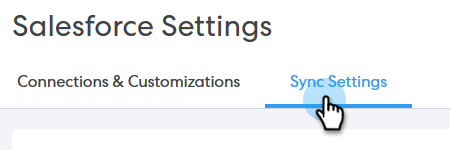
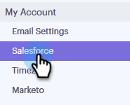
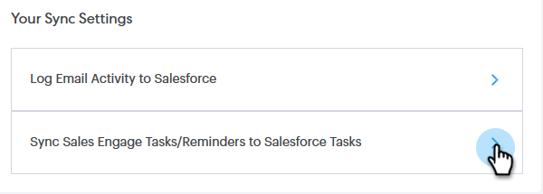

# Salesforce Sync Settings {#salesforce-sync-settings}

Salesforce Sync Settings - Marketo Docs - Product Documentation

### What's in this article? {#what-s-in-this-article}

[Logging Email Activity to Salesforce via API](#salesforcesyncsettings-loggingemailactivitytosalesforceviaapi)  
[Logging Email Activity to Salesforce via Email to Salesforce (BCC)](#salesforcesyncsettings-loggingemailactivitytosalesforceviaemailtosalesforce(bcc))  
[Sync Sales Engage Tasks/Reminders to Salesforce Tasks](#salesforcesyncsettings-syncsalesengagetasks/reminderstosalesforcetasks)

#### Logging Email Activity to Salesforce via API {#salesforcesyncsettings-loggingemailactivitytosalesforceviaapi}

This functionality requires you to be on the Enterprise/Unlimited edition of Salesforce, or the Professional edition if you've purchased Integration via Web Services API.

>[!NOTE]
>
>**Prerequisites**
>
>Salesforce and Sales Engage must be connected.

##### 1. In Sales Engage, click the gear icon on the upper-right and select Settings. {#salesforcesyncsettings-insalesengage-clickthegeariconontheupper-rightandselectsettings.}

##### 2. Under My Account (Admin Settings if you're an Admin), click Salesforce. {#salesforcesyncsettings-undermyaccount(adminsettingsifyou'reanadmin)-clicksalesforce.}

##### 3. Click the Sync Settings tab. {#salesforcesyncsettings-clickthesyncsettingstab.}

##### 4. Click the arrow next to Log Email Activity to Salesforce. {#salesforcesyncsettings-clickthearrownexttologemailactivitytosalesforce.}

##### 5. Click the Salesforce API tab. In this card you can set up your preference for logging information to Salesforce. Click Save when done. {#salesforcesyncsettings-clickthesalesforceapitab.inthiscardyoucansetupyourpreferenceforlogginginformationtosalesforce.clicksavewhendone.}

#### Logging Email Activity to Salesforce via Email to Salesforce (BCC) {#salesforcesyncsettings-loggingemailactivitytosalesforceviaemailtosalesforce(bcc)}

Once you activate “Email to Salesforce (BCC)”, you'll receive a BCC of your sales emails and your emails will be logged as activities on opportunities, leads and contacts.

>[!NOTE]
>
>**Prerequisites**
>
>Salesforce and Sales Engage must be connected.

**To log your emails in Salesforce via Email (BCC)** 

##### 1. In Sales Engage, click the gear icon on the upper-right and select Settings. {#salesforcesyncsettings-insalesengage-clickthegeariconontheupper-rightandselectsettings..1}

##### 2. Under My Account (Admin Settings if you're an Admin), click Salesforce. {#salesforcesyncsettings-undermyaccount(adminsettingsifyou'reanadmin)-clicksalesforce..1}

##### 3. Click the Sync Settings tab. {#salesforcesyncsettings-clickthesyncsettingstab..1}

##### 4. Click the Email to Salesforce (BCC) tab and click Activate. {#salesforcesyncsettings-clicktheemailtosalesforce(bcc)tabandclickactivate.}

If for some reason your Email to Salesforce address does not pull in, follow these steps to activate the BCC feature in your Salesforce account:

##### 1. Log-in to your Salesforce instance. {#salesforcesyncsettings-log-intoyoursalesforceinstance.}

##### 2. Find your user name in the upper-right corner and select the drop-down bar. {#salesforcesyncsettings-findyourusernameintheupper-rightcornerandselectthedrop-downbar.}

##### 3. Select My Settings. {#salesforcesyncsettings-selectmysettings.}

##### 4. Select Email. {#salesforcesyncsettings-selectemail.}

##### 5. Select My Email to Salesforce. {#salesforcesyncsettings-selectmyemailtosalesforce.}

##### 6. On this page, you'll see a field labeled "Email to Salesforce Address." If there is nothing populated next to it, scroll down to "My Acceptable Email Addresses." {#salesforcesyncsettings-onthispage-you'llseeafieldlabeled"emailtosalesforceaddress."ifthereisnothingpopulatednexttoit-scrolldownto"myacceptableemailaddresses."}

##### 7. Enter the email address(es) that you want BCC'd. {#salesforcesyncsettings-entertheemailaddress(es)thatyouwantbcc'd.}

##### 8. Click Save Changes. {#salesforcesyncsettings-clicksavechanges.}

**Can't Find My Email to Salesforce in My Settings**

If you don't see My Email to Salesforce under your Settings, your Admin may not have enabled it. This can happen if your team is new to Salesforce, or your team has never used the BCC address that Salesforce provides.

>[!NOTE]
>
>You will need Admin privileges to set this up.

##### 1. Click Setup*.* {#salesforcesyncsettings-clicksetup.}

##### 2. Click Email Administration*.* {#salesforcesyncsettings-clickemailadministration.}

##### 3. Click Email to Salesforce*.* {#salesforcesyncsettings-clickemailtosalesforce.}

##### 4. Click Edit. {#salesforcesyncsettings-clickedit.}

##### 5. Check the box next to "Active*."* {#salesforcesyncsettings-checktheboxnextto"active."}

##### 6. Click Save*.* {#salesforcesyncsettings-clicksave.}

#### Sync Sales Engage Tasks/Reminders to Salesforce Tasks {#salesforcesyncsettings-syncsalesengagetasks/reminderstosalesforcetasks}

##### 1. Click the gear icon on the upper-right and select Settings. {#salesforcesyncsettings-clickthegeariconontheupper-rightandselectsettings.}

##### 2. Under My Account (Admin Settings if you're an Admin), click Salesforce. {#salesforcesyncsettings-undermyaccount(adminsettingsifyou'reanadmin)-clicksalesforce..2}

##### 3. Click the Sync Settings tab. {#salesforcesyncsettings-clickthesyncsettingstab..2}

##### 4. Click the arrow next to Sync Sales Engage Tasks/Reminders to Salesforce Tasks. {#salesforcesyncsettings-clickthearrownexttosyncsalesengagetasks/reminderstosalesforcetasks.}

##### 5. Choose the desired option ("Do not sync to Salesforce tasks" is selected by default). {#salesforcesyncsettings-choosethedesiredoption("donotsynctosalesforcetasks"isselectedbydefault).}

