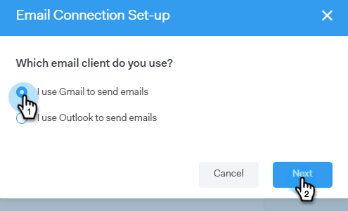

# Email Connection Tab for Gmail Users {#email-connection-tab-for-gmail-users}

Email Connection Tab for Gmail Users - Marketo Docs - Product Documentation

Connecting to Gmail means you'll receive reply tracking, access to the Gmail delivery channel, the ability to schedule emails in Gmail, and send compliance.

##### 1. In Sales Connect, click the gear icon and select Settings. {#emailconnectiontabforgmailusers-insalesconnect-clickthegeariconandselectsettings.}

##### 2. Under My Account, select Email Settings. {#emailconnectiontabforgmailusers-undermyaccount-selectemailsettings.}

##### 3. Click the Email Connection tab. {#emailconnectiontabforgmailusers-clicktheemailconnectiontab.}

##### 4. Click Get Started. {#emailconnectiontabforgmailusers-clickgetstarted.}

##### 5. Select I use Gmail to send emails and click Next. {#emailconnectiontabforgmailusers-selectiusegmailtosendemailsandclicknext.}

##### 6. Click OK. {#emailconnectiontabforgmailusers-clickok.}

##### 7. If you've already logged in to Gmail, choose the account you’d like to connect to. If not, enter your Gmail address and click Next. In this example, we're not yet logged in. {#emailconnectiontabforgmailusers-ifyou'vealreadyloggedintogmail-choosetheaccountyou’dliketoconnectto.ifnot-enteryourgmailaddressandclicknext.inthisexample-we'renotyetloggedin.}

##### 8. Enter your password and click Next. {#emailconnectiontabforgmailusers-enteryourpasswordandclicknext.}

##### 9. Click Allow. {#emailconnectiontabforgmailusers-clickallow.}

You can use this connection to track emails and also [as a delivery channel](http://docs.marketo.com/display/public/DOCS/Setting+up+Your+Delivery+Channel#SettingupYourDeliveryChannel-Gmail).
