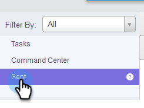
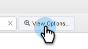
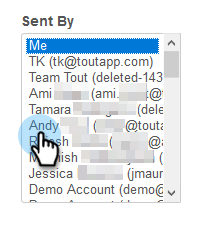
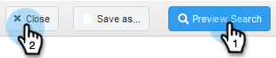
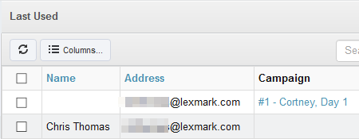

# View Sent Folder as Another User {#view-sent-folder-as-another-user}

View Sent Folder as Another User - Marketo Docs - Product Documentation

As an Admin, you can view the sent folder of any user.

>[!NOTE]
>
>**Admin Permissions Required**

##### 1. In the Command Center, click Sent. {#viewsentfolderasanotheruser-inthecommandcenter-clicksent.}

##### 2. Click the View Options button. {#viewsentfolderasanotheruser-clicktheviewoptionsbutton.}

##### 3. In the Sent By box, select the desired user. {#viewsentfolderasanotheruser-inthesentbybox-selectthedesireduser.}

##### 4. Click Preview Search, then Close. {#viewsentfolderasanotheruser-clickpreviewsearch-thenclose.}

##### 5. You are now viewing sent emails as the selected user. {#viewsentfolderasanotheruser-youarenowviewingsentemailsastheselecteduser.}

