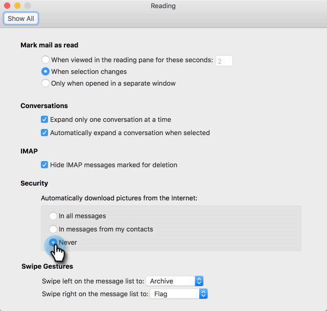

# Preventing Self Views {#preventing-self-views}

Preventing Self Views - Marketo Docs - Product Documentation

### What's in this article? {#what-s-in-this-article}

[Overview](#preventingselfviews-overview)  
[Web (Outlook Web App and Gmail)](#preventingselfviews-web(outlookwebappandgmail))  
[Desktop (Windows)](#preventingselfviews-desktop(windows))  
[Desktop (Mac)](#preventingselfviews-desktop(mac))

#### Overview {#preventingselfviews-overview}

Getting false positives on your view tracking can lead to reporting inconsistencies. This often occurs when users of MSC accidentally invoke the tracking pixel from their email client (we call this a self-view). Below are a few tips on significantly reducing and even eliminating self-views.

#### Web (Outlook Web App and Gmail) {#preventingselfviews-web(outlookwebappandgmail)}

Sales Connect will store a cookie in your browser to prevent views from being tracked when opening your emails from Outlook Web App and Gmail. If you are still receiving self-views, we recommend doing the following:

* Ensure that you have cookies enabled on your computer.

* If you're using a new computer or mobile device, make sure you've logged in to the web application. This will allow us to recognize your computer/device going forward.

#### Desktop (Windows) {#preventingselfviews-desktop(windows)}

Views are tracked by downloading a small invisible image pixel in your email client. You can significantly lower the amount of self-views in Outlook by disabling images to be automatically downloaded. Below are the steps how.

##### 1. In Outlook, click File in the menu bar. {#preventingselfviews-inoutlook-clickfileinthemenubar.}

##### 2. Click Options. {#preventingselfviews-clickoptions.}

##### 3. In the Outlook Options dialog box, click Trust Center. {#preventingselfviews-intheoutlookoptionsdialogbox-clicktrustcenter.}

##### 4. Under Microsoft Outlook Trust Center, click Trust Center Settings. {#preventingselfviews-undermicrosoftoutlooktrustcenter-clicktrustcentersettings.}

##### 5. Click Automatic Download in the menu on the left, and select the Don't download pictures automatically in HTML email or RSS items check box. {#preventingselfviews-clickautomaticdownloadinthemenuontheleft-andselectthedon'tdownloadpicturesautomaticallyinhtmlemailorrssitemscheckbox.}

##### 6. Click OK in the Trust Center dialog box. {#preventingselfviews-clickokinthetrustcenterdialogbox.}

##### 7. Click OK in the Outlook Options dialog box. {#preventingselfviews-clickokintheoutlookoptionsdialogbox.}

#### Desktop (Mac) {#preventingselfviews-desktop(mac)}

Views are tracked by downloading a small invisible image pixel in your email client. You can significantly lower the amount of self-views in Outlook by disabling images to be automatically downloaded. Below are the steps how.

##### 1. In Outlook, click Outlook in the menu bar and select Preferences. {#preventingselfviews-inoutlook-clickoutlookinthemenubarandselectpreferences.}

##### 2. Under Email, choose Reading. {#preventingselfviews-underemail-choosereading.}

##### 3. Under Security, click the Never radio button. {#preventingselfviews-undersecurity-clicktheneverradiobutton.}

