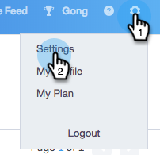
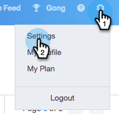
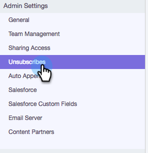

# Customize Unsubscribe Link Message {#customize-unsubscribe-link-message}

Customize Unsubscribe Link Message - Marketo Docs - Product Documentation

We have always allowed teams to customize their unsubscribe link messaging, but now admins can set the unsubscribe link messaging for their entire team to ensure consistent messaging.

>[!NOTE]
>
>You cannot use a third party unsubscribe link with Sales Connect as this information will not be captured back into our database.

### What's in this article? {#what-s-in-this-article}

[Customize Messaging for Yourself](#customizeunsubscribelinkmessage-customizemessagingforyourself)  
[Set Unsubscribe Messaging for Your Team](#customizeunsubscribelinkmessage-setunsubscribemessagingforyourteam)

#### Customize Messaging for Yourself {#customizeunsubscribelinkmessage-customizemessagingforyourself}

##### 1. Log-in to the [web application](http://toutapp.com/login), click the gear icon on the top right and choose Settings. {#customizeunsubscribelinkmessage-log-intothewebapplication-clickthegearicononthetoprightandchoosesettings.}

##### 2. Under My Account, select Unsubscribes. {#customizeunsubscribelinkmessage-undermyaccount-selectunsubscribes.}

##### 3. Write out your custom messaging in the text box. {#customizeunsubscribelinkmessage-writeoutyourcustommessaginginthetextbox.}

##### 4. Highlight the text you want people to click on to get to your unsubscribe page, then click the link icon. {#customizeunsubscribelinkmessage-highlightthetextyouwantpeopletoclickontogettoyourunsubscribepage-thenclickthelinkicon.}

>[!NOTE]
>
>It will not matter what the URL is that is being hyperlinked. When the email is sent that hyperlink will be converted to our unsubscribe link.

##### 5. Click OK. {#customizeunsubscribelinkmessage-clickok.}

#### Set Unsubscribe Messaging for Your Team {#customizeunsubscribelinkmessage-setunsubscribemessagingforyourteam}

##### 1. Log-in to the [web application](http://toutapp.com/login), click the gear icon on the top right and choose Settings. {#customizeunsubscribelinkmessage-log-intothewebapplication-clickthegearicononthetoprightandchoosesettings..1}

##### 2. Under Admin Settings, select Unsubscribes. {#customizeunsubscribelinkmessage-underadminsettings-selectunsubscribes.}

##### 3. Customize your messaging and click Save when done. {#customizeunsubscribelinkmessage-customizeyourmessagingandclicksavewhendone.}

##### 4. Select I am setting the default messaging for my team to have the messaging apply to all users. {#customizeunsubscribelinkmessage-selectiamsettingthedefaultmessagingformyteamtohavethemessagingapplytoallusers.}

