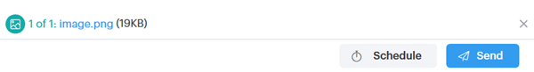

# Add an Attachment or Trackable Content to Your Email {#add-an-attachment-or-trackable-content-to-your-email}

Add an Attachment or Trackable Content to Your Email - Marketo Docs - Product Documentation

When sending an email through Sales Connect, you have the option of adding a file as an attachment, or making a file a downloadable (and trackable) link.

### What's in this article? {#what-s-in-this-article}

[Add an Attachment](#addanattachmentortrackablecontenttoyouremail-addanattachment)  
[Add Trackable Content](#addanattachmentortrackablecontenttoyouremail-addtrackablecontent)

#### Add an Attachment {#addanattachmentortrackablecontenttoyouremail-addanattachment}

##### 1. Create your email draft (there are multiple ways to do this, in this example we're choosing Compose in the header). {#addanattachmentortrackablecontenttoyouremail-createyouremaildraft(therearemultiplewaystodothis-inthisexamplewe'rechoosingcomposeintheheader).}

##### 2. Populate the To field and enter a Subject. {#addanattachmentortrackablecontenttoyouremail-populatethetofieldandenterasubject.}

##### 3. Click the attachment icon. {#addanattachmentortrackablecontenttoyouremail-clicktheattachmenticon.}

##### 4. Select the file you want to attach and click Insert. {#addanattachmentortrackablecontenttoyouremail-selectthefileyouwanttoattachandclickinsert.}

>[!NOTE]
>
>If you need to upload a file, click the **Upload Content** button in the upper-right of the window.

The attachment appears at the bottom of your email.   

#### Add Trackable Content {#addanattachmentortrackablecontenttoyouremail-addtrackablecontent}

##### 1. Create your email draft (there are multiple ways to do this, in this example we're choosing the Compose window). {#addanattachmentortrackablecontenttoyouremail-createyouremaildraft(therearemultiplewaystodothis-inthisexamplewe'rechoosingthecomposewindow).}

##### 2. Populate the To field and enter a Subject. {#addanattachmentortrackablecontenttoyouremail-populatethetofieldandenterasubject..1}

##### 3. Click the spot in the email you want the trackable content to appear and click the attachment icon. {#addanattachmentortrackablecontenttoyouremail-clickthespotintheemailyouwantthetrackablecontenttoappearandclicktheattachmenticon.}

##### 4. Select the content you want added, click the Content is Tracked slider, and click Insert. {#addanattachmentortrackablecontenttoyouremail-selectthecontentyouwantadded-clickthecontentistrackedslider-andclickinsert.}

>[!NOTE]
>
>If you need to upload a file, click the **Upload Content** button in the upper-right of the window.

The content appears as a link in your email. The recipient can click the link to download the content.

>[!NOTE]
>
>Users will be notified in the Live Feed when people are viewing their tracked content. Users can also see the highest performing content in the content section of the Analytics page.

