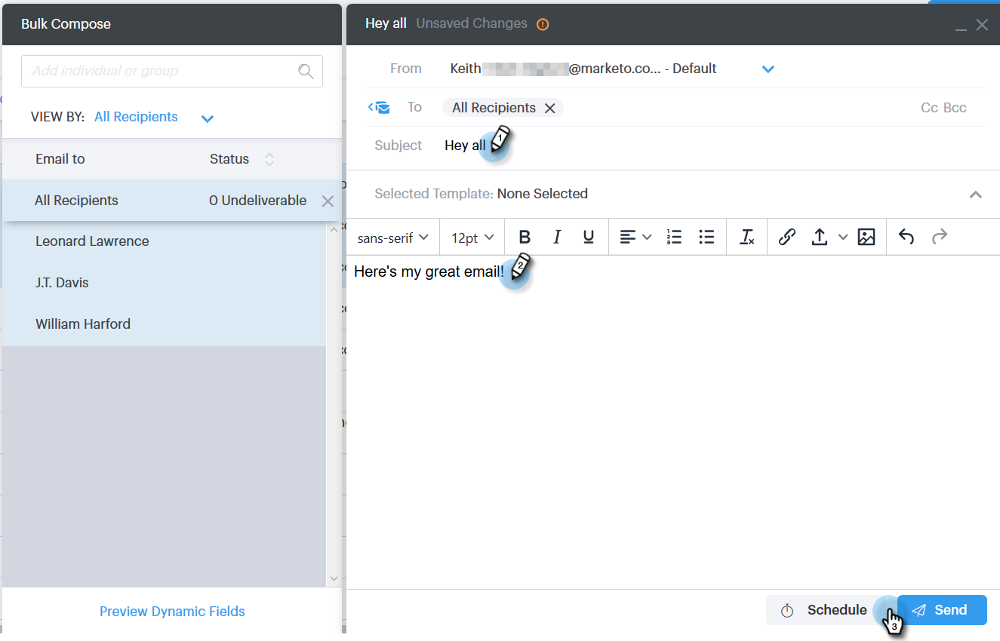

# Composing Bulk Emails with Select and Send {#composing-bulk-emails-with-select-and-send}

Composing Bulk Emails with Select and Send - Marketo Docs - Product Documentation

Here's how to send/edit emails using the Select and Send option.

### What's in this article? {#what-s-in-this-article}

[Sending Emails](#composingbulkemailswithselectandsend-sendingemails)  
[Editing Emails](#composingbulkemailswithselectandsend-editingemails)

#### Sending Emails {#composingbulkemailswithselectandsend-sendingemails}

##### 1. Navigate to the People page. {#composingbulkemailswithselectandsend-navigatetothepeoplepage.}

##### 2. Select the people you'd like to email. {#composingbulkemailswithselectandsend-selectthepeopleyou'dliketoemail.}

>[!NOTE]
>
>A maximum of 200 people can be selected when using Select and Send.

##### 3. Click the Email Selected button. {#composingbulkemailswithselectandsend-clicktheemailselectedbutton.}

##### 4. Enter a subject line, select a template (or compose the email from scratch), and send/ [schedule](http://docs.marketo.com/x/GAQ6Ag)the email. {#composingbulkemailswithselectandsend-enterasubjectline-selectatemplate(orcomposetheemailfromscratch)-andsend/scheduletheemail.}

>[!NOTE]
>
>If you selected a template and would like to check that all of the dynamic fields are populating correctly before sending, click **Preview Dynamic Fields**. Ensure all recipients in the bulk sidebar are selected to preview for all emails. If you select one email and click **Preview Dynamic Fields**, only that email will be previewed.

#### Editing Emails {#composingbulkemailswithselectandsend-editingemails}

**Bulk Edits**

##### 1. Follow Steps 1-3 from the [Sending Emails section](http://docs.marketo.com/display/DOCS/Composing+Bulk+Emails+with+Select+and+Send#ComposingBulkEmailswithSelectandSend-SendingEmails). {#composingbulkemailswithselectandsend-followsteps1-3fromthesendingemailssection.}

>[!NOTE]
>
>All of the recipients will be selected by default. If you click on an individual and want to re-select everyone, click **All Recipients**. As a reminder, all of the recipients must be selected in order to make bulk edits.

##### 2. Make your changes in the editor. You can create a new email or edit a template (in this example we're creating a new email). {#composingbulkemailswithselectandsend-makeyourchangesintheeditor.youcancreateanewemailoreditatemplate(inthisexamplewe'recreatinganewemail).}

>[!NOTE]
>
>You can click on a specific email recipient to see the changes propagated to that email.

##### 3. Click Send (or [Schedule](http://docs.marketo.com/x/GAQ6Ag)) to send to all recipients with the bulk email updates you made. {#composingbulkemailswithselectandsend-clicksend(orschedule)tosendtoallrecipientswiththebulkemailupdatesyoumade.}

**Edit Each Email**

Complete Bulk Updates before customizing each email, as making a bulk update overwrites changes to every email in the bulk compose sidebar.

##### 1. Follow Steps 1-4 from the [Sending Emails section.  
](http://docs.marketo.com/display/DOCS/Composing+Bulk+Emails+with+Select+and+Send#ComposingBulkEmailswithSelectandSend-SendingEmails) {#composingbulkemailswithselectandsend-followsteps1-4fromthesendingemailssection.}

>[!NOTE]
>
>All of the recipients will be selected by default. If you click on an individual and want to re-select everyone, click **All Recipients**. As a reminder, all of the recipients must be selected in order to make bulk edits.

##### 2. Select an individual recipient. {#composingbulkemailswithselectandsend-selectanindividualrecipient.}

##### 3. Make your changes in the editor. {#composingbulkemailswithselectandsend-makeyourchangesintheeditor.}

>[!NOTE]
>
>This is where you can make edits to a single email in the bulk sidebar without updating the rest of the emails.

>[!TIP]
>
>You can click on other recipients to see that the changes you made to the previously selected recipient are not showing.

##### 4. Click Send (or [Schedule](http://docs.marketo.com/x/GAQ6Ag)) to send to all recipients with the bulk email updates you made. {#composingbulkemailswithselectandsend-clicksend(orschedule)tosendtoallrecipientswiththebulkemailupdatesyoumade..1}

>[!NOTE]
>
>**Related Articles**
>
>* [Bulk Sending Options](http://docs.marketo.com/x/HwQ6Ag)
>* [Using a Template in the Compose Window](http://docs.marketo.com/x/MQQ6Ag)
>* [Dynamic Fields](http://docs.marketo.com/x/wwDb)
>

