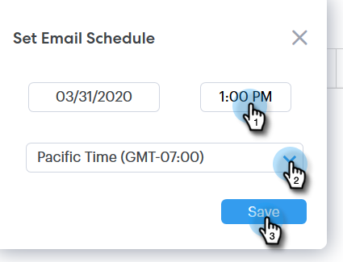
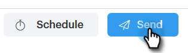

# Scheduling an Email {#scheduling-an-email}

Scheduling an Email - Marketo Docs - Product Documentation

Follow these easy steps to schedule an email.

>[!NOTE]
>
>To update your default time zone, go to the Settings page.

##### 1. Create your email draft (there are multiple ways to do this, in this example we're choosing Compose in the header). {#schedulinganemail-createyouremaildraft(therearemultiplewaystodothis-inthisexamplewe'rechoosingcomposeintheheader).}

##### 2. When you're done composing your email, click Schedule on the bottom right {#schedulinganemail-whenyou'redonecomposingyouremail-clickscheduleonthebottomright}

##### 3. Click the date to open the date picker and select a date. {#schedulinganemail-clickthedatetoopenthedatepickerandselectadate.}

##### 4. Enter the time you want the email to go out. Select the desired time zone and click Save. Close the scheduler when done. {#schedulinganemail-enterthetimeyouwanttheemailtogoout.selectthedesiredtimezoneandclicksave.closetheschedulerwhendone.}

##### 5. Now that your scheduled date/time is selected, click Send to schedule the email. {#schedulinganemail-nowthatyourscheduleddate/timeisselected-clicksendtoscheduletheemail.}

>[!NOTE]
>
>Scheduled emails can be viewed/edited in the scheduled folders section of the Command Center.

>[!NOTE]
>
>**Related Articles**
>
>[ `Command` Center Overview](http://docs.marketo.com/x/kgDb)

