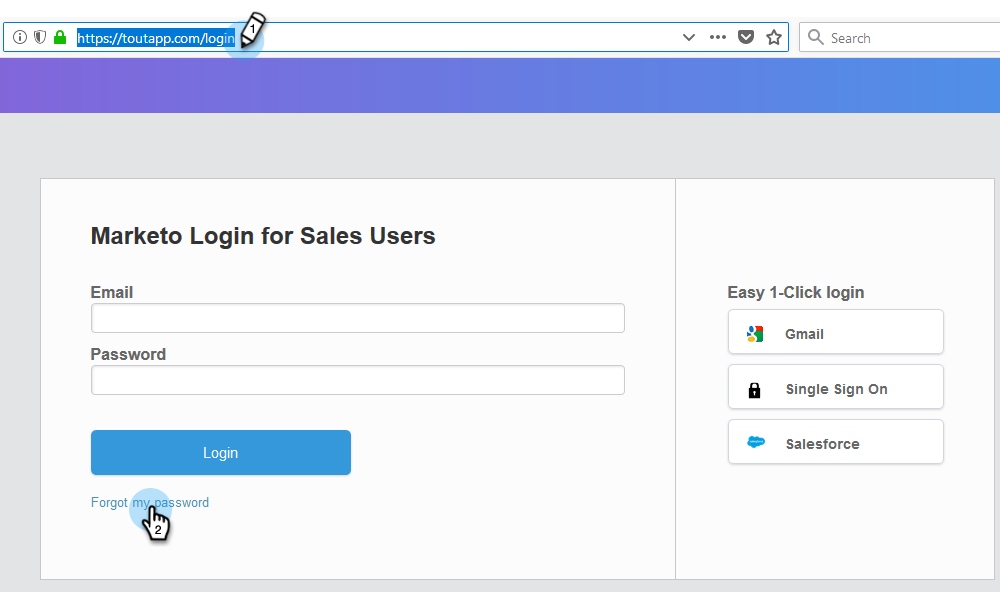
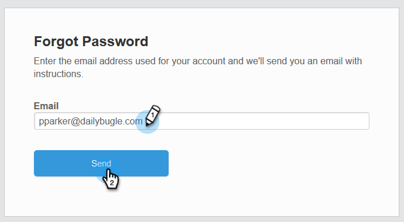
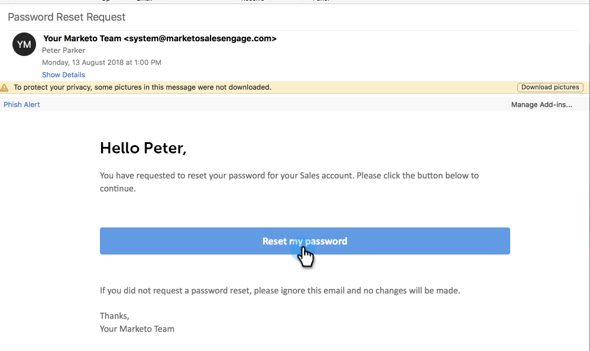
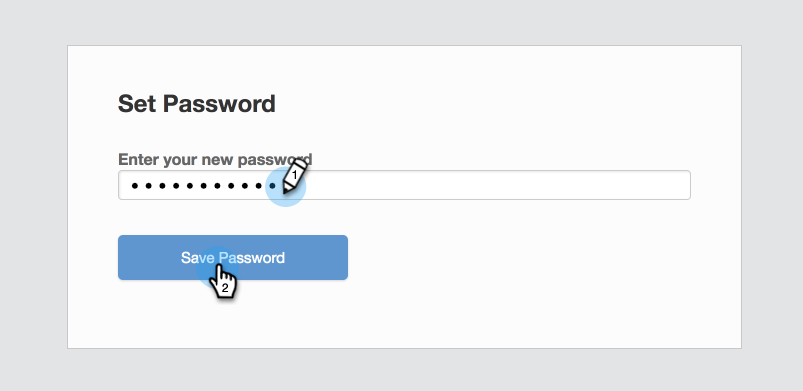

# How Do I Change My Password? {#how-do-i-change-my-password}

How Do I Change My Password? - Marketo Docs - Product Documentation

Follow these steps to change your password.

##### 1. Navigate to the Sales Connect [log-in page](http://toutapp.com/login) and click Forgot my password. {#howdoichangemypassword?-navigatetothesalesconnectlog-inpageandclickforgotmypassword.}

##### 2. Enter the email address associated with the account and click Send. {#howdoichangemypassword?-entertheemailaddressassociatedwiththeaccountandclicksend.}

##### 3. We will send an email to verify the account owner wants to change the password. Click Reset my password.  {#howdoichangemypassword?-wewillsendanemailtoverifytheaccountownerwantstochangethepassword.clickresetmypassword.}

>[!NOTE]
>
>Be sure to check your Spam folder too, as this email can sometimes end up there.

##### 4. Enter your new password and click Save Password. {#howdoichangemypassword?-enteryournewpasswordandclicksavepassword.}

