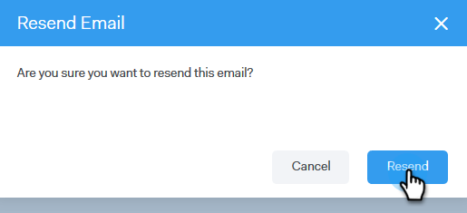

# Verify Your Email {#verify-your-email}

Verify Your Email - Marketo Docs - Product Documentation

If you have an email identity that isn't verified, follow the steps below.

##### 1. Click the gear icon on the top right and choose Settings. {#verifyyouremail-clickthegearicononthetoprightandchoosesettings.}

##### 2. Under My Account, click Email Settings. {#verifyyouremail-undermyaccount-clickemailsettings.}

##### 3. Under Address and Signature, find the email identity you’d like to verify and click Resend Verify Email. A new verification email will be sent. {#verifyyouremail-underaddressandsignature-findtheemailidentityyou’dliketoverifyandclickresendverifyemail.anewverificationemailwillbesent.}

##### 4. Click Resend. {#verifyyouremail-clickresend.}

##### 5. The recipient then opens the email and follows the steps to verify the email identity. {#verifyyouremail-therecipientthenopenstheemailandfollowsthestepstoverifytheemailidentity.}

