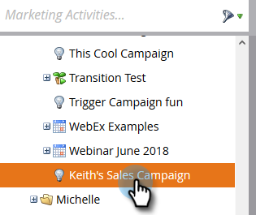
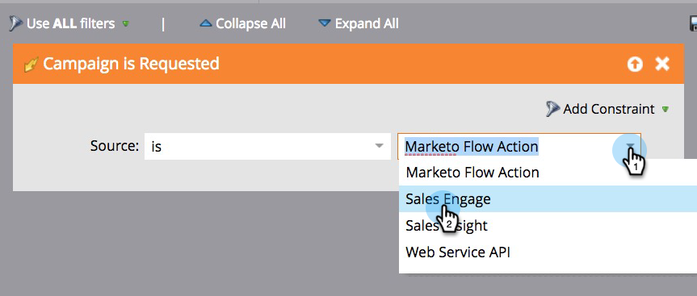
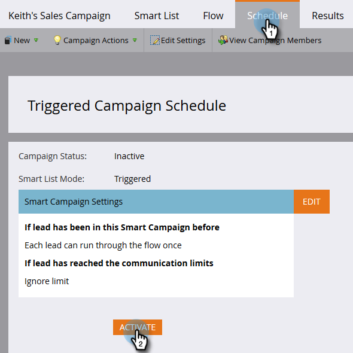

# Make a Campaign Visible to Sales Connect Users {#make-a-campaign-visible-to-sales-connect-users}

Make a Campaign Visible to Sales Connect Users - Marketo Docs - Product Documentation

Campaigns can only be shared if they're made visible. Here's how to do that.

##### 1. Select (or create) the Campaign you want shared. {#makeacampaignvisibletosalesconnectusers-select(orcreate)thecampaignyouwantshared.}

##### 2. Click the Smart List tab. {#makeacampaignvisibletosalesconnectusers-clickthesmartlisttab.}

##### 3. Add the Campaign is Requested trigger. {#makeacampaignvisibletosalesconnectusers-addthecampaignisrequestedtrigger.}

##### 4. For source, choose "is" Sales Engage (Sales Engage is the previous name of Sales Connect). {#makeacampaignvisibletosalesconnectusers-forsource-choose"is"salesengage(salesengageisthepreviousnameofsalesconnect).}

##### 5. Click the Flow tab. {#makeacampaignvisibletosalesconnectusers-clicktheflowtab.}

##### 6. Add the Interesting Moment flow action. {#makeacampaignvisibletosalesconnectusers-addtheinterestingmomentflowaction.}

##### 7. For Type, select Web. {#makeacampaignvisibletosalesconnectusers-fortype-selectweb.}

##### 8. In the Description box, write a message to your sales team. In this example we're using tokens to specify the form that was filled out. {#makeacampaignvisibletosalesconnectusers-inthedescriptionbox-writeamessagetoyoursalesteam.inthisexamplewe'reusingtokenstospecifytheformthatwasfilledout.}

##### 9. Click the Schedule tab and Activate the campaign. {#makeacampaignvisibletosalesconnectusers-clickthescheduletabandactivatethecampaign.}

