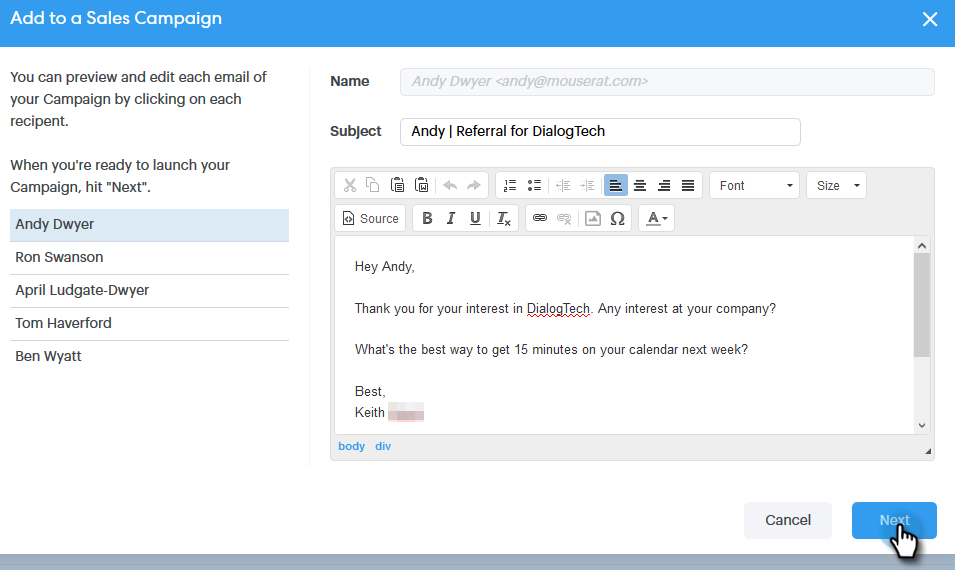
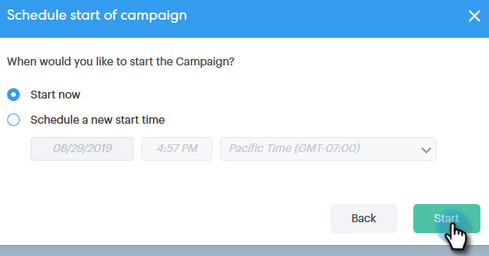

# Connecting with a Group {#connecting-with-a-group}

Connecting with a Group - Marketo Docs - Product Documentation

Learn how to send an email to an entire group, or add a group to a campaign.

### What's in this article? {#what-s-in-this-article}

[Group Action: Email](#connectingwithagroup-groupaction-email)  
[Group Action: Add to Sales Campaign](#connectingwithagroup-groupaction-addtosalescampaign)

#### Group Action: Email {#connectingwithagroup-groupaction-email}

##### 1. Select the group you'd like to email. {#connectingwithagroup-selectthegroupyou'dliketoemail.}

##### 2. Click the Group Actions button and select Email Group. {#connectingwithagroup-clickthegroupactionsbuttonandselectemailgroup.}

##### 3. Fill out your email and schedule/send it. {#connectingwithagroup-filloutyouremailandschedule/sendit.}

And that's it. Everyone in that group will receive the email.

#### Group Action: Add to Sales Campaign {#connectingwithagroup-groupaction-addtosalescampaign}

##### 1. Select the group you'd like to add to a campaign. {#connectingwithagroup-selectthegroupyou'dliketoaddtoacampaign.}

##### 2. Click the Group Actions button and select Add Group to Campaign. {#connectingwithagroup-clickthegroupactionsbuttonandselectaddgrouptocampaign.}

##### 3. Confirm the right people have been selected and click Next. {#connectingwithagroup-confirmtherightpeoplehavebeenselectedandclicknext.}

>[!NOTE]
>
>You may see an option to add to a Marketo Campaign. [That's a different article](http://docs.marketo.com/x/CwDh).

##### 4. Select a campaign (you can select a category to narrow your results) and click Next. {#connectingwithagroup-selectacampaign(youcanselectacategorytonarrowyourresults)andclicknext.}

##### 5. Make any edits you'd like and click Next. {#connectingwithagroup-makeanyeditsyou'dlikeandclicknext.}

##### 6. Schedule the campaign and click Start. {#connectingwithagroup-schedulethecampaignandclickstart.}

