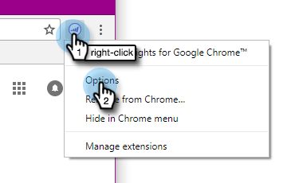

# Install Marketo Insights for Google Chrome {#install-marketo-insights-for-google-chrome}

Install Marketo Insights for Google Chrome - Marketo Docs - Product Documentation

Follow these steps to begin using the powerful Chrome add-in.

>[!NOTE]
>
>You do not need to be a Marketo admin to install the extension.

##### 1. Install the [Marketo Insights for Google Chrome Add in extension](https://chrome.google.com/webstore/detail/marketo-for-google-mail/jjkfbhajlmoeegbjgjipliamplidmbjb) from the Chrome Web Store. {#installmarketoinsightsforgooglechrome-installthemarketoinsightsforgooglechromeaddinextensionfromthechromewebstore.}

##### 2. Right-click on the Marketo logo in Chrome and select Options. {#installmarketoinsightsforgooglechrome-right-clickonthemarketologoinchromeandselectoptions.}

##### 3. Enter your Reg code, Email Address, First Name, and Last Name. Click Verify and Save. {#installmarketoinsightsforgooglechrome-enteryourregcode-emailaddress-firstname-andlastname.clickverifyandsave.}

>[!CAUTION]
>
>Be sure to use your **primary email account** when registering, as we do not support the use of aliases for this plugin.

>[!NOTE]
>
>The `Reg code`will be in the email sent after a Marketo Admin [i](http://docs.marketo.com/pages/viewpage.action?pageid=7510848) [ssues you a Marketo Email Add-in License](../../../../welcome-to-marketo-docs/product-docs/marketo-sales-insight/msi-outlook-plugin/issue-a-marketo-email-add-in-license.md) [.](http://docs.marketo.com/pages/viewpage.action?pageid=7510848)

##### 4. Click Allow to allow offline access. {#installmarketoinsightsforgooglechrome-clickallowtoallowofflineaccess.}

>[!NOTE]
>
>**Related Articles**
>
>[Using Marketo Insights for Google Chrome](using-marketo-insights-for-google-chrome.md)

