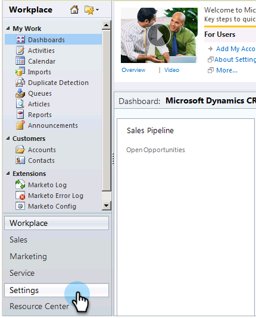
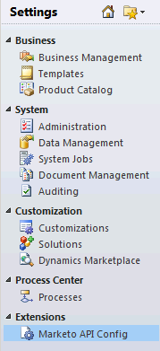

# Install and Configure Marketo Sales Insight in Microsoft Dynamics 2011 {#install-and-configure-marketo-sales-insight-in-microsoft-dynamics}

Install and Configure Marketo Sales Insight in Microsoft Dynamics 2011 - Marketo Docs - Product Documentation

Marketo Sales Insight is a fantastic tool for your sales team. Here is the step-by-step instruction of how to install and configure it in Microsoft Dynamics 2011 On-Premises.

>[!NOTE]
>
>**Prerequisites**
>
>Complete your [Marketo-Microsoft integration](http://docs.marketo.com/x/DoA2).
>
>[Download the correct solution](http://docs.marketo.com/x/LoJo) for your version of Microsoft Dynamics CRM.

### What's in this article? {#what-s-in-this-article}

[Import Solution](#installandconfiguremarketosalesinsightinmicrosoftdynamics2011-importsolution)  
[Connect Marketo and Sales Insight](#installandconfiguremarketosalesinsightinmicrosoftdynamics2011-connectmarketoandsalesinsight)  
[Set User Access](#installandconfiguremarketosalesinsightinmicrosoftdynamics2011-setuseraccess)

#### Import Solution {#installandconfiguremarketosalesinsightinmicrosoftdynamics2011-importsolution}

##### 1. Sign in to Microsoft Dynamics CRM. Click Settings in the bottom left menu. {#installandconfiguremarketosalesinsightinmicrosoftdynamics2011-signintomicrosoftdynamicscrm.clicksettingsinthebottomleftmenu.}

##### 2. Select Solutions in the tree. {#installandconfiguremarketosalesinsightinmicrosoftdynamics2011-selectsolutionsinthetree.}

##### 3. Click Import ( ). {#installandconfiguremarketosalesinsightinmicrosoftdynamics2011-clickimport().}

>[!NOTE]
>
>**Reminder**
>
>You should already have [installed and configured](install-and-configure-marketo-sales-insight-in-microsoft-dynamics-2011.md) the Marketo solution before moving forward.

##### 4. Click Browse. Select the Marketo Sales Insight solution you [downloaded](download-the-marketo-sales-insight-solution-for-microsoft-dynamics.md). Click Next. {#installandconfiguremarketosalesinsightinmicrosoftdynamics2011-clickbrowse.selectthemarketosalesinsightsolutionyoudownloaded.clicknext.}

##### 5. Verify the details of the solution, and click Next. {#installandconfiguremarketosalesinsightinmicrosoftdynamics2011-verifythedetailsofthesolution-andclicknext.}

##### 6. Make sure the SDK message option is checked. Click Next. {#installandconfiguremarketosalesinsightinmicrosoftdynamics2011-makesurethesdkmessageoptionischecked.clicknext.}

##### 7. Now wait for the import to finish. {#installandconfiguremarketosalesinsightinmicrosoftdynamics2011-nowwaitfortheimporttofinish.}

##### 8. Click Close. {#installandconfiguremarketosalesinsightinmicrosoftdynamics2011-clickclose.}

##### 9. Marketo Sales Insight will now show up in the solution list. Yay! {#installandconfiguremarketosalesinsightinmicrosoftdynamics2011-marketosalesinsightwillnowshowupinthesolutionlist.yay!}

##### 10. Select Marketo Sales Insight and click on Publish All Customizations ( ). {#installandconfiguremarketosalesinsightinmicrosoftdynamics2011-selectmarketosalesinsightandclickonpublishallcustomizations().}

#### Connect Marketo and Sales Insight  {#installandconfiguremarketosalesinsightinmicrosoftdynamics2011-connectmarketoandsalesinsight}

>[!NOTE]
>
>**Admin Permissions Required**

##### 1. Log in to Marketo and click Admin. {#installandconfiguremarketosalesinsightinmicrosoftdynamics2011-logintomarketoandclickadmin.}

1. Under the **Sales Insight **section click **Edit API Configuration**.

   

1. Copy the **Marketo Host**, **API URL**, and **API User Id** for use in a later step. Enter an **API Secret Key** of your choice and click **SAVE**.

   >[!CAUTION]
   >
   >Don't use an ampersand (&) in your API Secret Key.

   

   >[!NOTE]
   >
   >The following fields must be synced with Marketo for *both Lead and Contact* for Sales Insight to work:
   >
   >    
   >    
   >    * Priority 
   >    * Urgency
   >    * Relative Score
   >    
   >    
   >If any of these fields are missing, you will see an error message in Marketo with the name of the missing fields. To fix this, perform [this procedure](../../../../../welcome-to-marketo-docs/product-docs/marketo-sales-insight/msi-for-microsoft-dynamics/setting-up-and-using/required-fields-for-syncing-marketo-with-dynamics.md).

   ##### Go back to Dynamics, select Settings. {#installandconfiguremarketosalesinsightinmicrosoftdynamics2011-gobacktodynamics-selectsettings.}

   

   ##### Select Marketo API Config in the tree. {#installandconfiguremarketosalesinsightinmicrosoftdynamics2011-selectmarketoapiconfiginthetree.}

   

   ##### Click Default Configuration. {#installandconfiguremarketosalesinsightinmicrosoftdynamics2011-clickdefaultconfiguration.}

   

   ##### Enter the information you took from Marketo earlier. {#installandconfiguremarketosalesinsightinmicrosoftdynamics2011-entertheinformationyoutookfrommarketoearlier.}

   

   ##### Click Save. {#installandconfiguremarketosalesinsightinmicrosoftdynamics2011-clicksave.}

   ** 

   **

####  Set User Access {#installandconfiguremarketosalesinsightinmicrosoftdynamics2011-setuseraccess}

Set up user roles to give specific users access to Sales Insight.

##### 1. Select Settings. {#installandconfiguremarketosalesinsightinmicrosoftdynamics2011-selectsettings.}

##### 2. Select Administration in the tree. {#installandconfiguremarketosalesinsightinmicrosoftdynamics2011-selectadministrationinthetree.}

##### 3. Click Users. {#installandconfiguremarketosalesinsightinmicrosoftdynamics2011-clickusers.}

##### 4. Select the user(s) you want to grant access to and click Manage Roles. {#installandconfiguremarketosalesinsightinmicrosoftdynamics2011-selecttheuser(s)youwanttograntaccesstoandclickmanageroles.}

##### 5. Select the Marketo Sales Insight role and click OK. {#installandconfiguremarketosalesinsightinmicrosoftdynamics2011-selectthemarketosalesinsightroleandclickok.}

And that's it! All the users have access will now be able to see the sales insight section in the lead/contact detail view.

Congrats. You have now unleashed the power of Marketo Sales Insight.

>[!NOTE]
>
>**Related Articles**
>
>[Setting up Stars and Flames for Lead/Contact Records](http://docs.marketo.com/x/BICMAg)

