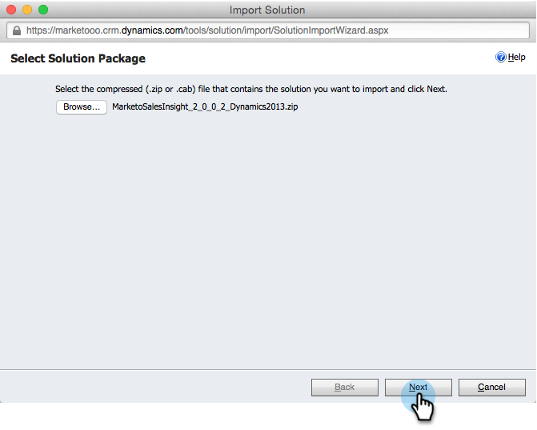
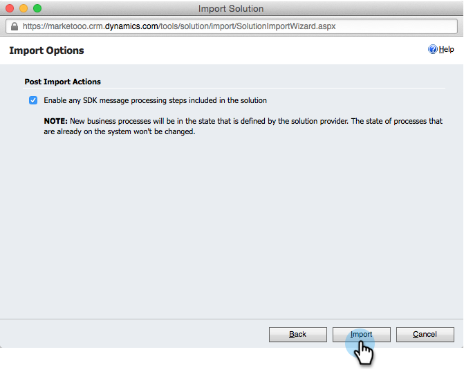
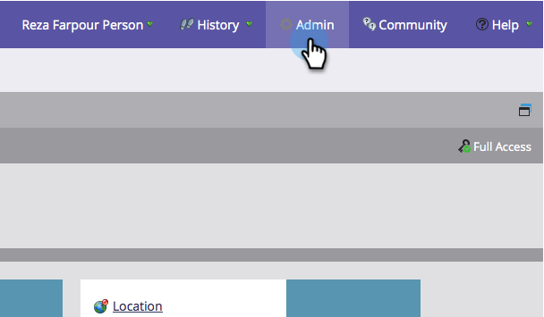

# Install and Configure Marketo Sales Insight in Microsoft Dynamics 2013 {#install-and-configure-marketo-sales-insight-in-microsoft-dynamics}

Install and Configure Marketo Sales Insight in Microsoft Dynamics 2013 - Marketo Docs - Product Documentation

Marketo Sales Insight is a fantastic tool for giving your sales team a "window" into the wealth of data the marketing team has. Here's how to install and configure it.

>[!NOTE]
>
>**Prerequisites**
>
>Complete your [Marketo-Microsoft integration](http://docs.marketo.com/x/EIA2).
>
>[Download the correct solution](http://docs.marketo.com/x/LoJo) for your version of Microsoft Dynamics CRM.

### What's in this article? {#what-s-in-this-article}

[Import Solution](#installandconfiguremarketosalesinsightinmicrosoftdynamics2013-importsolution)  
[Connect Marketo and Sales Insight](#installandconfiguremarketosalesinsightinmicrosoftdynamics2013-connectmarketoandsalesinsight)  
[Set User Access](#installandconfiguremarketosalesinsightinmicrosoftdynamics2013-setuseraccess)

#### Import Solution {#installandconfiguremarketosalesinsightinmicrosoftdynamics2013-importsolution}

OK, now it's time to import the Marketo Sales Insight solution into Microsoft Dynamics.

1. Under **Microsoft Dynamics CRM** click **Settings**.

   

1. Under **Settings**, click **Customizations**.

   

1. Click **Solutions**.

   

   >[!NOTE]
   >
   >**Reminder**
   >
   >
   >You should already have installed and configured Marketo before moving forward

1. Click **Import**.

   

1. In the new window, click **Browse**.

   

1. Find and select the solution you downloaded above.

   

1. Click **Next**.

   

1. The solution will upload. You can view the package contents if you like. Click **Next**.

   

1. Make sure to leave the box checked and click **Import**.

   

1. Feel free to download the log file. Click **Close**.

   

1. Awesome! You should see the solution now. If it's not there, refresh your screen.

   

#### Connect Marketo and Sales Insight {#installandconfiguremarketosalesinsightinmicrosoftdynamics2013-connectmarketoandsalesinsight}

Let's tie your Marketo instance to Sales Insight in Dynamics.

>[!NOTE]
>
>Admin rights required.

1. Log in to Marketo and go to the **Admin** section.

   

1. Under the **Sales Insight** section click **Edit API Configuration**.

   

1. Copy the **Marketo Host**, **API URL**, and **API User Id** for use in a later step. Enter an **API Secret Key** of your choice and click **SAVE**.

   >[!CAUTION]
   >
   >Don't use an ampersand (&) in your API Secret Key.

   

   >[!NOTE]
   >
   >The following fields must be synced with Marketo for *both Lead and Contact* for Sales Insight to work:
   >
   >    
   >    
   >    * Priority 
   >    * Urgency
   >    * Relative Score
   >    
   >    
   >If any of these fields are missing, you will see an error message in Marketo with the name of the missing fields. To fix this, perform [this procedure](../../../../../welcome-to-marketo-docs/product-docs/marketo-sales-insight/msi-for-microsoft-dynamics/setting-up-and-using/required-fields-for-syncing-marketo-with-dynamics.md).

1. Back in Microsoft Dynamics, go to **Settings**.

   

1. Under **Settings**, click **Marketo API Config**.

   

1. Click **New**.

   

1. Enter the information that you took from Marketo earlier and click **Save**.

   

#### Set User Access {#installandconfiguremarketosalesinsightinmicrosoftdynamics2013-setuseraccess}

Finally, you can give specific users access to Marketo Sales Insight.

1. Go to **Settings**.

   

1. Click **Users**.

   

1. Select the user(s) you want to give access to Sales Insight to and click **Manage Roles**.

   

1. Select the **Marketo Sales Insight** role and click **OK**.

   

   And you should be all done! Finally, to test, log in to Dynamics as a user who has access to Marketo Sales Insight and look at a lead or contact.

   

You have now unlocked the power of Marketo Sales Insight for your sales team.

>[!NOTE]
>
>**Related Articles**
>
>[Setting up Stars and Flames for Lead/Contact Records](http://docs.marketo.com/x/BICMAg)

