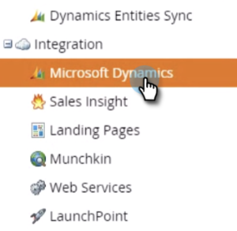

# Disable Global MS Dynamics Sync {#disable-global-ms-dynamics-sync}

Disable Global MS Dynamics Sync - Marketo Docs - Product Documentation

Follow these simple steps to disable your MS Dynamics sync.

##### 1. In Marketo, click Admin. {#disableglobalmsdynamicssync-inmarketo-clickadmin.}

##### 2. Under Integration, click Microsoft Dynamics. {#disableglobalmsdynamicssync-underintegration-clickmicrosoftdynamics.}

##### 3. Click Disable Sync. {#disableglobalmsdynamicssync-clickdisablesync.}

>[!NOTE]
>
>If you do not see a Disable Sync button in your instance, please contact [Marketo Support](http://nation.marketo.com/community/support_solutions).

