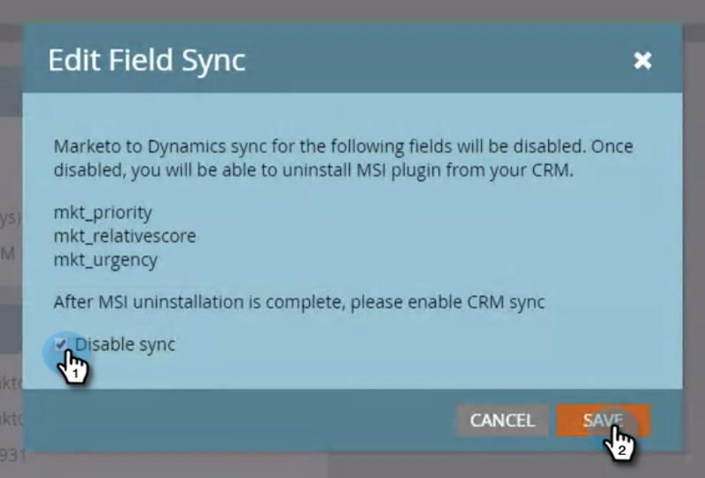

# Uninstall MSI from your MS Dynamics Instance {#uninstall-msi-from-your-ms-dynamics-instance}

Uninstall MSI from your MS Dynamics Instance - Marketo Docs - Product Documentation

To uninstall MSI from your MS Dynamics instance, you'll need to perform steps in both Marketo and MS Dynamics.

>[!NOTE]
>
>**Prerequisites**
>
>[Disable Global MS Dynamics Sync](http://docs.marketo.com/x/TAA6Ag)

##### 1. In Marketo, click Admin. {#uninstallmsifromyourmsdynamicsinstance-inmarketo-clickadmin.}

##### 2. Click Sales Insight. {#uninstallmsifromyourmsdynamicsinstance-clicksalesinsight.}

##### 3. Click Edit Field Sync. {#uninstallmsifromyourmsdynamicsinstance-clickeditfieldsync.}

##### 4. Select the Disable Sync checkbox and click Save. {#uninstallmsifromyourmsdynamicsinstance-selectthedisablesynccheckboxandclicksave.}

>[!NOTE]
>
>**Reminder**
>
>Make sure you [disable the Global MS Dynamics Sync](http://docs.marketo.com/x/TAA6Ag) prior to disabling the field sync.

  

#### The following steps take place in your MS Dynamics instance: {#uninstallmsifromyourmsdynamicsinstance-thefollowingstepstakeplaceinyourmsdynamicsinstance-}

##### 5. Click Advanced Settings. {#uninstallmsifromyourmsdynamicsinstance-clickadvancedsettings.}

##### 6. Click Solutions. {#uninstallmsifromyourmsdynamicsinstance-clicksolutions.}

##### 7. Select Marketo Sales Insight and click the delete icon. {#uninstallmsifromyourmsdynamicsinstance-selectmarketosalesinsightandclickthedeleteicon.}

##### 8. When the Uninstall Solution modal pops up, click OK. {#uninstallmsifromyourmsdynamicsinstance-whentheuninstallsolutionmodalpopsup-clickok.}

It usually takes about 20 minutes for MS Dynamics solution to fully uninstall. However, if you have a large MS Dynamics instance, it could take a bit longer.

>[!NOTE]
>
>**Reminder**
>
>Remember to turn on the Global MS Dynamics sync once you uninstall MSI.

