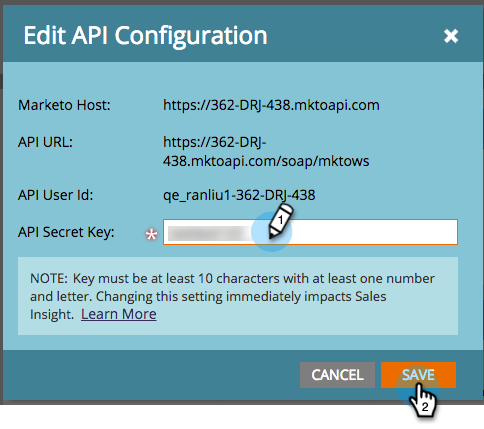
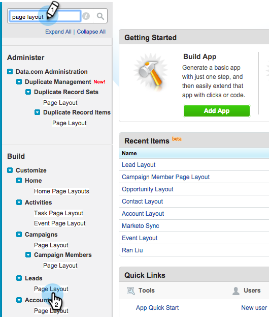

# Configure Marketo Sales Insight in Salesforce Professional Edition {#configure-marketo-sales-insight-in-salesforce-professional-edition}

Configure Marketo Sales Insight in Salesforce Professional Edition - Marketo Docs - Product Documentation

>[!NOTE]
>
>**FYI**
>
>Marketo is now standardizing language across all subscriptions, so you may see lead/leads in your subscription and person/people in docs.marketo.com. These terms mean the same thing; it does not affect article instructions. There are some other changes, too. [Learn more](http://docs.marketo.com/display/DOCS/Updates+to+Marketo+Terminology).

Here are the steps you need to take to configure Marketo Sales Insight in Salesforce Professional Edition. Let's get started.

>[!NOTE]
>
>**Prerequisites**
>
>[Install Marketo in your Salesforce Professional Edition](../../../../../welcome-to-marketo-docs/product-docs/crm-sync/salesforce-sync/setup/professional-edition.md)
>
>[Install Marketo Sales Insight Package in Salesforce AppExchange](../../../../../welcome-to-marketo-docs/product-docs/marketo-sales-insight/msi-for-salesforce/installation/install-marketo-sales-insight-package-in-salesforce-appexchange.md)

>[!NOTE]
>
>**Admin Permissions Required**

### What's in this article? {#what-s-in-this-article}

[Set up Marketo Sales Insight](#configuremarketosalesinsightinsalesforceprofessionaledition-setupmarketosalesinsight)  
[Customize Page Layouts](#configuremarketosalesinsightinsalesforceprofessionaledition-customizepagelayouts)  
[Map Custom Person Fields](#configuremarketosalesinsightinsalesforceprofessionaledition-mapcustompersonfields)  
[Marketo Sales Insight Config](#configuremarketosalesinsightinsalesforceprofessionaledition-marketosalesinsightconfig)

#### Set up Marketo Sales Insight {#configuremarketosalesinsightinsalesforceprofessionaledition-setupmarketosalesinsight}

##### 1. Log in to your Marketo instance and click Admin. {#configuremarketosalesinsightinsalesforceprofessionaledition-logintoyourmarketoinstanceandclickadmin.}

##### 2. Click Sales Insight. {#configuremarketosalesinsightinsalesforceprofessionaledition-clicksalesinsight.}

##### 3. Click Edit API Configuration. {#configuremarketosalesinsightinsalesforceprofessionaledition-clickeditapiconfiguration.}

##### 4. Enter an API Secret Key and click Save. {#configuremarketosalesinsightinsalesforceprofessionaledition-enteranapisecretkeyandclicksave.}

>[!CAUTION]
>
>Don't use an ampersand (&) in your API Secret Key.

>[!TIP]
>
>Keep this window open. You will need this information later in Salesforce.

##### 5. Go back to Salesforce, click Setup. {#configuremarketosalesinsightinsalesforceprofessionaledition-gobacktosalesforce-clicksetup.}

 

##### 6. Search for "remote site" and click Remote Site Setting under Security Controls. {#configuremarketosalesinsightinsalesforceprofessionaledition-searchfor"remotesite"andclickremotesitesettingundersecuritycontrols.}

 

##### 7. Click New Remote Site. {#configuremarketosalesinsightinsalesforceprofessionaledition-clicknewremotesite.}

 

##### 8. Enter Remote Site Name and Remote Site URL, then click Save. {#configuremarketosalesinsightinsalesforceprofessionaledition-enterremotesitenameandremotesiteurl-thenclicksave.}

>[!NOTE]
>
>You choose your **Remote Site Name** (MarketoAPI is used here). The **Remote Site URL** can be found in the Marketo Host field of your Edit API Configuration dialog box from Step 4.

####  Customize Page Layouts {#configuremarketosalesinsightinsalesforceprofessionaledition-customizepagelayouts}

##### 1. Click Setup. {#configuremarketosalesinsightinsalesforceprofessionaledition-clicksetup.}

##### 2. Search for "page layout" and select the Page Layout under Leads. {#configuremarketosalesinsightinsalesforceprofessionaledition-searchfor"pagelayout"andselectthepagelayoutunderleads.}

1. Click **Visualforce Pages **on the left. Drag **Section** to the layout underneath Custom Links section.

   

   ##### Enter "Marketo Sales Insight" as the Section Name. Select 1-Column and click OK. {#configuremarketosalesinsightinsalesforceprofessionaledition-enter"marketosalesinsight"asthesectionname.select1-columnandclickok.}

   

1. Drag and drop **Lead** into the new section.

   

   >[!TIP]
   >
   >The name of this box will change based on the object type. For example, if you are modifying the page layout for Contacts, it will say Contact.

1. Double-click on the **Lead** block that you just added.

   

1. Edit height to **450** pixels and click **OK**.

   

   >[!TIP]
   >
   >We recommend a height of 410 pixels for the Accounts and Opportunities objects.

1. Click on **Fields **on the left. Then search and drag the **Engagement** label into the **Marketo Sales Insight** layout.

   

1. Repeat the above step for these fields as well.

<table class="wrapped confluenceTable"> 
 <tbody> 
  <tr> 
   <td colspan="1">Engagement</td> 
  </tr> 
  <tr> 
   <td colspan="1" rowspan="1">
Relative Score Value
</td> 
  </tr> 
  <tr> 
   <td colspan="1" rowspan="1">
Urgency Value
</td> 
  </tr> 
  <tr> 
   <td colspan="1" rowspan="1">
Last Interesting Moment Date
</td> 
  </tr> 
  <tr> 
   <td colspan="1" rowspan="1">
Last Interesting Moment Desc
</td> 
  </tr> 
  <tr> 
   <td colspan="1" rowspan="1">
Last Interesting Moment Source
</td> 
  </tr> 
  <tr> 
   <td colspan="1" rowspan="1">
Last Interesting Moment Type
</td> 
  </tr> 
 </tbody> 
</table>

1. lick **Save** when finished.

   

   ##### Repeat this process to add Visualforce page sections and Sales Insight fields for Contact, Account and Opportunity. {#configuremarketosalesinsightinsalesforceprofessionaledition-repeatthisprocesstoaddvisualforcepagesectionsandsalesinsightfieldsforcontact-accountandopportunity.}

   ##### Repeat steps 5-7 to add Visualforce page sections for Contact, Account, and Opportunity. Then, repeat steps 8-10 to add Sales Insight fields for Contact. Be sure to save after any changes. {#configuremarketosalesinsightinsalesforceprofessionaledition-repeatsteps5-7toaddvisualforcepagesectionsforcontact-account-andopportunity.then-repeatsteps8-10toaddsalesinsightfieldsforcontact.besuretosaveafteranychanges.}

####  Map Custom Person Fields {#configuremarketosalesinsightinsalesforceprofessionaledition-mapcustompersonfields}

Marketo person fields need to be mapped to Salesforce contact fields to ensure that the conversion works properly. Here's how.

##### 1. Click Setup. {#configuremarketosalesinsightinsalesforceprofessionaledition-clicksetup..1}

##### 2. Search for "fields" in the search bar and click Fields under Leads. {#configuremarketosalesinsightinsalesforceprofessionaledition-searchfor"fields"inthesearchbarandclickfieldsunderleads.}

##### 3. Click Map Lead Fields. {#configuremarketosalesinsightinsalesforceprofessionaledition-clickmapleadfields.}

** 

**

##### 4. Click on the dropdown on the right for Engagement. {#configuremarketosalesinsightinsalesforceprofessionaledition-clickonthedropdownontherightforengagement.}

##### 5. Select Contact.Engagement in the list. {#configuremarketosalesinsightinsalesforceprofessionaledition-selectcontact.engagementinthelist.}

##### 6. Repeat and map these fields as well. {#configuremarketosalesinsightinsalesforceprofessionaledition-repeatandmapthesefieldsaswell.}

<table class="wrapped confluenceTable"> 
 <tbody> 
  <tr> 
   <th colspan="1" rowspan="1">Marketo Person Custom Field</th> 
   <th colspan="1" rowspan="1">Salesforce Contact Custom Field</th> 
  </tr> 
  <tr> 
   <td colspan="1" rowspan="1">
Engagement
</td> 
   <td colspan="1" rowspan="1">
Contact.Engagement
</td> 
  </tr> 
  <tr> 
   <td colspan="1" rowspan="1">
Relative Score Value
</td> 
   <td colspan="1" rowspan="1">
Contact.Relative Score Value
</td> 
  </tr> 
  <tr> 
   <td colspan="1" rowspan="1">
Urgency Value
</td> 
   <td colspan="1" rowspan="1">
Contact.Urgency Value
</td> 
  </tr> 
  <tr> 
   <td colspan="1" rowspan="1">
Last Interesting Moment Date
</td> 
   <td colspan="1" rowspan="1">
Contact.Last Interesting Moment Date
</td> 
  </tr> 
  <tr> 
   <td colspan="1" rowspan="1">
Last Interesting Moment Desc
</td> 
   <td colspan="1" rowspan="1">
Contact.Last Interesting Moment Desc
</td> 
  </tr> 
  <tr> 
   <td colspan="1" rowspan="1">
Last Interesting Moment Source
</td> 
   <td colspan="1" rowspan="1">
Contact.Last Interesting Moment Source
</td> 
  </tr> 
  <tr> 
   <td colspan="1" rowspan="1">
Last Interesting Moment Type
</td> 
   <td colspan="1" rowspan="1">
Contact.Last Interesting Moment Type
</td> 
  </tr> 
 </tbody> 
</table>

1. Click **Save **when you’re done.

   

####  Marketo Sales Insight Config {#configuremarketosalesinsightinsalesforceprofessionaledition-marketosalesinsightconfig}

##### 1. Click + and then select Marketo Sales Insight Config. {#configuremarketosalesinsightinsalesforceprofessionaledition-click+andthenselectmarketosalesinsightconfig.}

1. Check **Enable Marketo API**. Then fill in the [API Configuration info in Marketo Admin](https://docs.marketo.com/display/DOCS/Configure+Marketo+Sales+Insight+in+Salesforce+Professional+Edition#ConfigureMarketoSalesInsightinSalesforceProfessionalEdition-SetupMarketoSalesInsight). Click **Save Changes **when you are done.

   

   >[!NOTE]
   >
   >If the diagnostics test failed, you might need to [add more fields to your page layout](https://nation.marketo.com/docs/DOC-1115).

And that's it! You should be able to see the Marketo Sales Insight fields for Leads, Contacts, Accounts and Opportunities.

>[!NOTE]
>
>For accounts, Sales Insight will include all emails, but only the most recent interesting moments, web activity, and score changes.

>[!NOTE]
>
>**Related Articles**
>
>* [Priority, Urgency, Relative Score, and Best Bets](../../../../../welcome-to-marketo-docs/product-docs/marketo-sales-insight/msi-for-salesforce/features/stars-and-flames/priority-urgency-relative-score-and-best-bets.md)
>* [Add Marketo Sales Insight Tab and Buttons to Salesforce](../../../../../welcome-to-marketo-docs/product-docs/marketo-sales-insight/msi-for-salesforce/features/bulk-actions/add-marketo-sales-insight-tab-and-buttons-to-salesforce.md)
>

