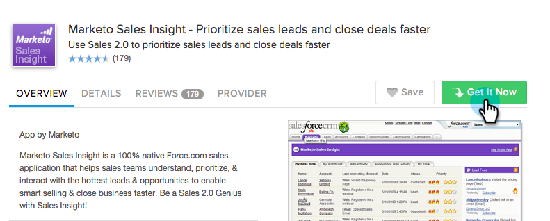
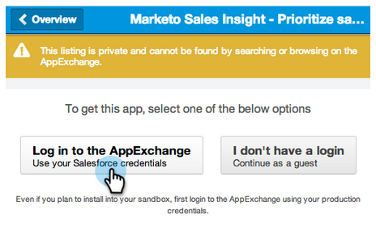
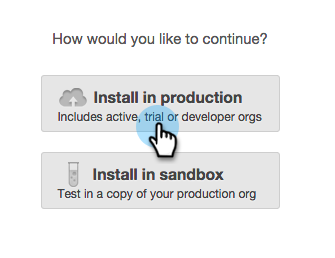
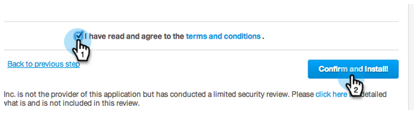
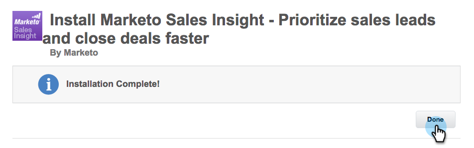
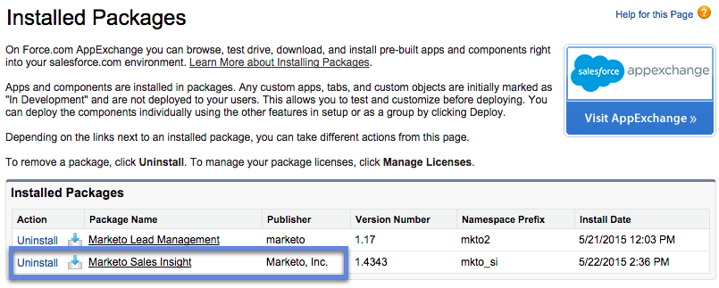
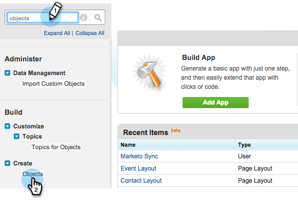
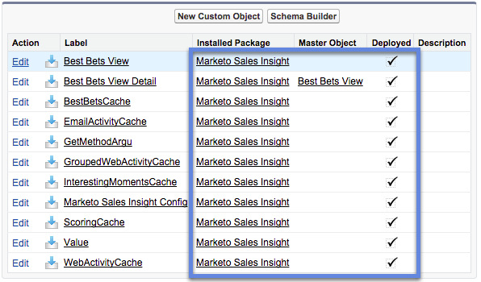
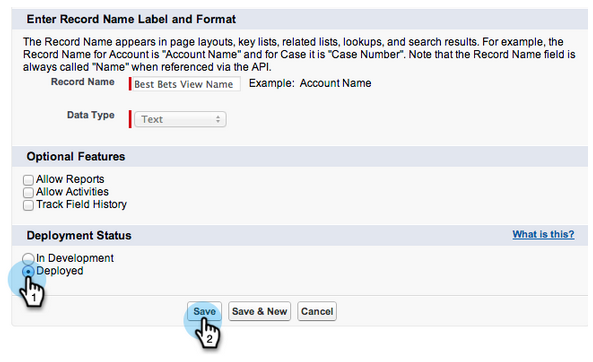

# Install Marketo Sales Insight Package in Salesforce AppExchange {#install-marketo-sales-insight-package-in-salesforce-appexchange}

Install Marketo Sales Insight Package in Salesforce AppExchange - Marketo Docs - Product Documentation

You need to install the Marketo Sales Insight app in your Salesforce subscription before you can enjoy all the goodness Sales Insight provides. Here's how.

>[!NOTE]
>
>**Admin Permissions Required**

>[!NOTE]
>
>Marketo Sales Insight is compatible with Salesforce Platform (Shield) Encryption.

##### 1. Go to the [AppExchange page for Marketo Sales Insight](http://appexchange.salesforce.com/listingDetail?listingId=a0N30000001SVZmEAO) and click Get it Now. {#installmarketosalesinsightpackageinsalesforceappexchange-gototheappexchangepageformarketosalesinsightandclickgetitnow.}

##### 2. Click Log in to the AppExchange button and log in with your Salesforce credentials. {#installmarketosalesinsightpackageinsalesforceappexchange-clicklogintotheappexchangebuttonandloginwithyoursalesforcecredentials.}

##### 3. Click Install in production. {#installmarketosalesinsightpackageinsalesforceappexchange-clickinstallinproduction.}

>[!TIP]
>
>Choose **Install in sandbox** if you want to test it out in your sandbox first.

1. Read and accept the terms and conditions, then click** Confirm and Install!**.

   

   ##### You can choose to “Install for Admins Only” (and provide MSI access to specific profiles later), “Install for All Users,” or, “Install for Specific Profiles.” {#installmarketosalesinsightpackageinsalesforceappexchange-youcanchooseto“installforadminsonly”(andprovidemsiaccesstospecificprofileslater)-“installforallusers-”or-“installforspecificprofiles.”}

   

   ##### Click Done when the installation is complete. {#installmarketosalesinsightpackageinsalesforceappexchange-clickdonewhentheinstallationiscomplete.}

   

   ##### Verify that Marketo Sales Insight is in the Installed Packages. {#installmarketosalesinsightpackageinsalesforceappexchange-verifythatmarketosalesinsightisintheinstalledpackages.}

   

   ##### Click Setup next to your name. {#installmarketosalesinsightpackageinsalesforceappexchange-clicksetupnexttoyourname.}

   

1. Search for "objects", then click **Objects** under **Create**.

   

1. Double-check that **Deployed** is checked for all of Marketo Sales Insight items.

   

1. If an object is not deployed, click **Edit **next to the item.

   

1. Under **Deployment Status** section, select **Deployed**, and click **Save**. 

   

Great job! Now you've installed and deployed Marketo Sales Insight. Go ahead and configure it for your sales team and watch the sales skyrocket.

>[!NOTE]
>
>**Related Articles**
>
>[Configure Marketo Sales Insight in Salesforce Professional Edition](../../../../../welcome-to-marketo-docs/product-docs/marketo-sales-insight/msi-for-salesforce/configuration/configure-marketo-sales-insight-in-salesforce-professional-edition.md)
>
>[Configure Marketo Sales Insight in Salesforce Enterprise/Unlimited](../../../../../welcome-to-marketo-docs/product-docs/marketo-sales-insight/msi-for-salesforce/configuration/configure-marketo-sales-insight-in-salesforce-enterprise/unlimited.md)

