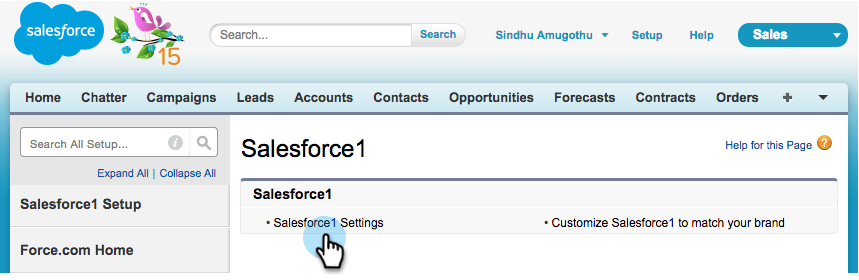
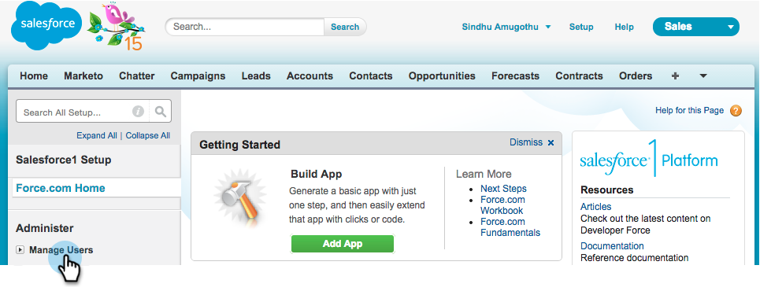
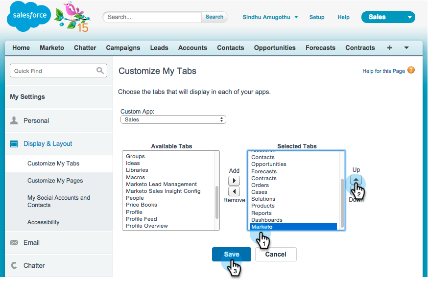
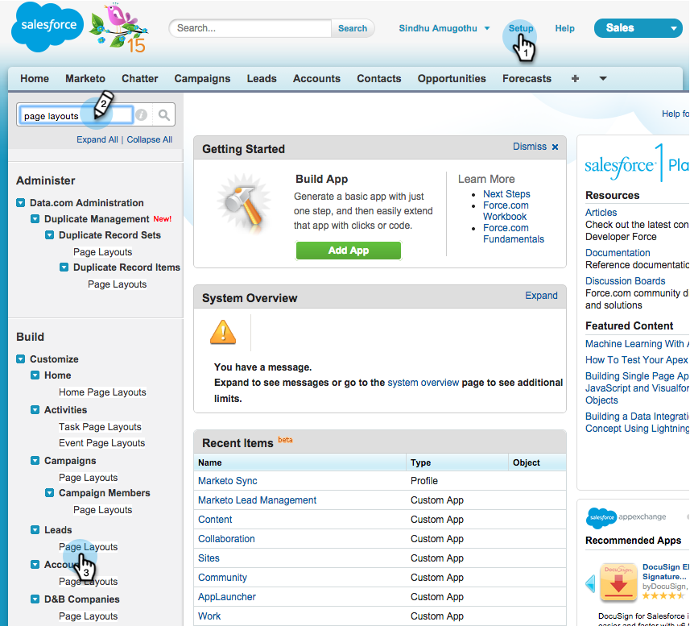

# Install and Configure Marketo Sales Insight in Salesforce1 {#install-and-configure-marketo-sales-insight-in-salesforce}

Install and Configure Marketo Sales Insight in Salesforce1 - Marketo Docs - Product Documentation

>[!NOTE]
>
>**Reminder**
>
>Existing customers, please [Upgrade Your MSI Package](http://docs.marketo.com/x/_gU6Ag) before you continue!

>[!NOTE]
>
>**Prerequisites**
>
>If you have Salesforce Enterprise/Unlimited:
>
>* [Step 1 of 3: Add Marketo Fields to Salesforce (Enterprise/Unlimited)](../../../../../welcome-to-marketo-docs/product-docs/crm-sync/salesforce-sync/setup/enterprise/unlimited-edition/step-1-of-3-add-marketo-fields-to-salesforce-(enterprise/unlimited).md)
>* [Step 2 of 3: Create a Salesforce User for Marketo (Enterprise/Unlimited)](../../../../../welcome-to-marketo-docs/product-docs/crm-sync/salesforce-sync/setup/enterprise/unlimited-edition/step-2-of-3-create-a-salesforce-user-for-marketo-(enterprise/unlimited).md)
>* [Step 3 of 3: Connect Marketo and Salesforce (Enterprise/Unlimited)](../../../../../welcome-to-marketo-docs/product-docs/crm-sync/salesforce-sync/setup/enterprise/unlimited-edition/step-3-of-3-connect-marketo-and-salesforce-(enterprise/unlimited).md)
>* [Configure Marketo Sales Insight in Salesforce Enterprise/Unlimited](../../../../../welcome-to-marketo-docs/product-docs/marketo-sales-insight/msi-for-salesforce/configuration/configure-marketo-sales-insight-in-salesforce-enterprise/unlimited.md)
>
>If you have Salesforce Professional:
>
>* [Configure Marketo Sales Insight in Salesforce Professional Edition](../../../../../welcome-to-marketo-docs/product-docs/marketo-sales-insight/msi-for-salesforce/configuration/configure-marketo-sales-insight-in-salesforce-professional-edition.md)
>

### What's in this article? {#what-s-in-this-article}

[Enable the Salesforce1 Mobile App](#installandconfiguremarketosalesinsightinsalesforce1-enablethesalesforce1mobileapp)  
[Hide Outdated Marketo Custom Object](#installandconfiguremarketosalesinsightinsalesforce1-hideoutdatedmarketocustomobject)  
[Customize Tabs](#installandconfiguremarketosalesinsightinsalesforce1-customizetabs)  
[Customize Page Layouts](#installandconfiguremarketosalesinsightinsalesforce1-customizepagelayouts)

>[!NOTE]
>
>Marketo Sales Insight in Salesforce1 includes: Best Bets, Lead Feed, Interesting Moments, and Add to Marketo Campaign.

1. 

   #### Enable the Salesforce1 Mobile App {#installandconfiguremarketosalesinsightinsalesforce1-enablethesalesforce1mobileapp}

1. Click **Setup** and then **Mobile Administration**.

   

1. Click on **Salesforce1**.

   

1. Click on **Salesforce1 Settings**.

   

1. Click on **Enable the Salesforce1 mobile browser app**.

   

1. Click **Save**.

   

1. Select **Mobile Administration**.

   

1. Click on **Manage the mobile navigation menu**.

   

1. Select **Marketo **and **Add **it to the **Selected **menu items.

   

1. Select **Marketo**, move it **Up **to a desired area, and click **Save**.

   

1. 

   #### Hide Outdated Marketo Custom Object {#installandconfiguremarketosalesinsightinsalesforce1-hideoutdatedmarketocustomobject}

   ##### Click Setup. {#installandconfiguremarketosalesinsightinsalesforce1-clicksetup.}

   

   ##### Select Manage Users. {#installandconfiguremarketosalesinsightinsalesforce1-selectmanageusers.}

   

   ##### Select Profiles. {#installandconfiguremarketosalesinsightinsalesforce1-selectprofiles.}

   

   ##### Click to edit any desired profiles. {#installandconfiguremarketosalesinsightinsalesforce1-clicktoeditanydesiredprofiles.}

   

   ##### Under Tab Settings, select the *first* Marketo. {#installandconfiguremarketosalesinsightinsalesforce1-undertabsettings-selectthefirstmarketo.}

   ** 

   **

   ##### Select Tab Hidden. {#installandconfiguremarketosalesinsightinsalesforce1-selecttabhidden.}

   ** 

   **

   >[!NOTE]
   >
   >Make sure to hide the Marketo tab for all desired profiles!

1. 

   #### Customize Tabs {#installandconfiguremarketosalesinsightinsalesforce1-customizetabs}

   ##### Click +. {#installandconfiguremarketosalesinsightinsalesforce1-click+.}

   

   ##### Click Customize My Tabs. {#installandconfiguremarketosalesinsightinsalesforce1-clickcustomizemytabs.}

   

   ##### Select Marketo and Add it to the Selected Tabs. {#installandconfiguremarketosalesinsightinsalesforce1-selectmarketoandaddittotheselectedtabs.}

   

1. Select **Marketo**, move it **Up **to a desired area, and click **Save**.

   

1. 

   #### Customize Page Layouts {#installandconfiguremarketosalesinsightinsalesforce1-customizepagelayouts}

   ##### Click Setup. {#installandconfiguremarketosalesinsightinsalesforce1-clicksetup..1}

   

   ##### Click Setup, type Page Layouts, and click Page Layouts under Leads. {#installandconfiguremarketosalesinsightinsalesforce1-clicksetup-typepagelayouts-andclickpagelayoutsunderleads.}

   >[!NOTE]
   >
   >Repeat the steps for every Page Layout that your organization uses (marketing, sales, etc.) for Contact, Account, and Opportunity objects.

   

   ##### Click Edit to make changes to the Lead Layout. {#installandconfiguremarketosalesinsightinsalesforce1-clickedittomakechangestotheleadlayout.}

   

   ##### Click Visualforce Pages and then drag Lead Mobile to the Mobile Cards section. {#installandconfiguremarketosalesinsightinsalesforce1-clickvisualforcepagesandthendragleadmobiletothemobilecardssection.}

   

   ##### Change the Height to 66 and click OK. {#installandconfiguremarketosalesinsightinsalesforce1-changetheheightto66andclickok.}

   

   ##### Click Fields and drag Add to Marketo Campaign to the Marketo Sales Insight section. {#installandconfiguremarketosalesinsightinsalesforce1-clickfieldsanddragaddtomarketocampaigntothemarketosalesinsightsection.}

   

   >[!TIP]
   >
   >Type "Add to" into the Quick Find to make Add to Marketo Campaign easy to find.

   ##### Click Save. {#installandconfiguremarketosalesinsightinsalesforce1-clicksave..1}

   

Phew! You're finally done installing Marketo Sales Insight for Salesforce1! Go ahead and give yourself a pat on the back.

>[!NOTE]
>
>**Related Articles**
>
>* [Best Bets in Salesforce1](best-bets-in-salesforce1.md)
>* [Interesting Moments in Salesforce1](interesting-moments-in-salesforce1.md)
>* [Send Marketo Email and Campaign and Watchlist Actions in Salesforce1](send-marketo-email-and-campaign-and-watchlist-actions-in-salesforce1.md)
>

