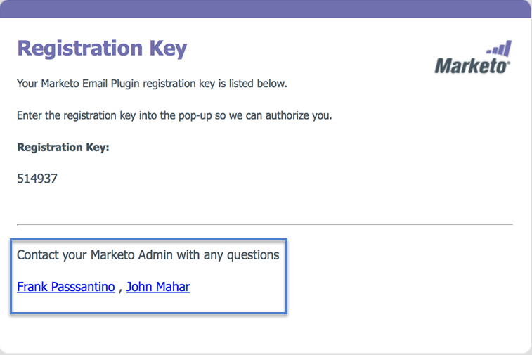

# Specify Marketo Sales Insight Plugin Admins {#specify-marketo-sales-insight-plugin-admins}

Specify Marketo Sales Insight Plugin Admins - Marketo Docs - Product Documentation

You can specify which contacts you want to appear in the email notice you send to users when you invite them to set up MSI on Outlook.

##### 1. In My Marketo, click Admin and then Sales Insight. {#specifymarketosalesinsightpluginadmins-inmymarketo-clickadminandthensalesinsight.}

##### 2. Click the Email Add-In tab. {#specifymarketosalesinsightpluginadmins-clicktheemailadd-intab.}

##### 3. Click Specify Plugin Contact. {#specifymarketosalesinsightpluginadmins-clickspecifyplugincontact.}

##### 4. Click to specify plugin contacts. {#specifymarketosalesinsightpluginadmins-clicktospecifyplugincontacts.}

##### 5. Click Save. {#specifymarketosalesinsightpluginadmins-clicksave.}

##### 6. The contacts you selected will be listed in the email sales reps receive during the authorization process. {#specifymarketosalesinsightpluginadmins-thecontactsyouselectedwillbelistedintheemailsalesrepsreceiveduringtheauthorizationprocess.}

Perfect!
