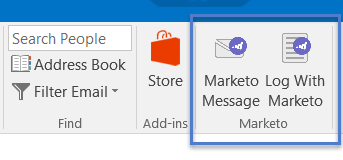

# Upgrade your Marketo Email Add-In for Outlook {#upgrade-your-marketo-email-add-in-for-outlook}

Upgrade your Marketo Email Add-In for Outlook - Marketo Docs - Product Documentation

`When a new version of the Marketo Email Add-in for Outlook is available, follow these instructions to upgrade.` 

#### Download Installer {#upgradeyourmarketoemailadd-inforoutlook-downloadinstaller}

Download the installer appropriate for your version of Microsoft Outlook.

<table class="wrapped confluenceTable"> 
 <colgroup> 
  <col> 
  <col> 
  <col> 
  <col> 
  <col> 
 </colgroup> 
 <tbody> 
  <tr> 
   <th> </th> 
   <th colspan="2">Single User Invite Installation</th> 
   <th colspan="2">Enterprise Key Installation</th> 
  </tr> 
  <tr> 
   <td><strong>Outlook Version</strong></td> 
   <td><strong>32-bit</strong></td> 
   <td><strong>64-bit</strong></td> 
   <td><strong>32-bit</strong></td> 
   <td><strong>64-bit</strong></td> 
  </tr> 
  <tr> 
   <td>Outlook 2000</td> 
   <td>Not Supported</td> 
   <td>N/A</td> 
   <td>Not Supported</td> 
   <td>N/A</td> 
  </tr> 
  <tr> 
   <td>Outlook 2003</td> 
   <td><a href="http://munchkin.marketo.net/MarketoAddInSetup32.msi" class="external-link" rel="nofollow">Download</a></td> 
   <td>N/A</td> 
   <td>Not Supported</td> 
   <td>N/A</td> 
  </tr> 
  <tr> 
   <td>Outlook 2007</td> 
   <td><a href="http://munchkin.marketo.net/MarketoAddInSetup32.msi" class="external-link" rel="nofollow">Download</a></td> 
   <td>N/A</td> 
   <td>Not Supported</td> 
   <td>N/A</td> 
  </tr> 
  <tr> 
   <td>Outlook 2010</td> 
   <td><a href="http://munchkin.marketo.net/MarketoAddInSetup32.msi" class="external-link" rel="nofollow">Download</a></td> 
   <td><a href="http://munchkin.marketo.net/MarketoAddInSetup64.msi" class="external-link" rel="nofollow">Download</a></td> 
   <td><a href="http://munchkin.marketo.net/MarketoAddInSetup32.msi" class="external-link" rel="nofollow">Download</a></td> 
   <td><a href="http://munchkin.marketo.net/MarketoAddInSetup64.msi" class="external-link" rel="nofollow">Download</a></td> 
  </tr> 
  <tr> 
   <td>Outlook 2013</td> 
   <td><a href="http://munchkin.marketo.net/MarketoAddInSetup32.msi" class="external-link" rel="nofollow">Download</a></td> 
   <td><a href="http://munchkin.marketo.net/MarketoAddInSetup64.msi" class="external-link" rel="nofollow">Download</a></td> 
   <td><a href="http://munchkin.marketo.net/MarketoAddInSetup32.msi" class="external-link" rel="nofollow">Download</a></td> 
   <td><a href="http://munchkin.marketo.net/MarketoAddInSetup64.msi" style="text-decoration: underline;" class="external-link" rel="nofollow">Download</a></td> 
  </tr> 
  <tr> 
   <td>Outlook 2016</td> 
   <td><a style="text-decoration: underline;" href="http://munchkin.marketo.net/MarketoAddInSetup32.msi" class="external-link" rel="nofollow">Download</a></td> 
   <td><a style="text-decoration: underline;" href="http://munchkin.marketo.net/MarketoAddInSetup64.msi" class="external-link" rel="nofollow">Download</a></td> 
   <td><a href="http://munchkin.marketo.net/MarketoAddInSetup32.msi" class="external-link" rel="nofollow">Download</a></td> 
   <td><a href="http://munchkin.marketo.net/MarketoAddInSetup64.msi" class="external-link" rel="nofollow">Download</a></td> 
  </tr> 
  <tr> 
   <td colspan="1">Outlook 2019</td> 
   <td colspan="1"><a href="http://munchkin.marketo.net/MarketoAddInSetup32.msi" style="text-decoration: underline;" class="external-link" rel="nofollow">Download</a></td> 
   <td colspan="1"><a style="text-decoration: underline;" href="http://munchkin.marketo.net/MarketoAddInSetup64.msi" class="external-link" rel="nofollow">Download</a></td> 
   <td colspan="1"><a href="http://munchkin.marketo.net/MarketoAddInSetup32.msi" class="external-link" rel="nofollow">Download</a></td> 
   <td colspan="1"><a href="http://munchkin.marketo.net/MarketoAddInSetup64.msi" class="external-link" rel="nofollow">Download</a></td> 
  </tr> 
  <tr> 
   <td colspan="1">Outlook O365 (Windows only)</td> 
   <td colspan="1"><a href="http://munchkin.marketo.net/MarketoAddInSetup32.msi" style="text-decoration: underline;" class="external-link" rel="nofollow">Download</a></td> 
   <td colspan="1"><a style="text-decoration: underline;" href="http://munchkin.marketo.net/MarketoAddInSetup64.msi" class="external-link" rel="nofollow">Download</a></td> 
   <td colspan="1"><a href="http://munchkin.marketo.net/MarketoAddInSetup32.msi" class="external-link" rel="nofollow">Download</a></td> 
   <td colspan="1"><a href="http://munchkin.marketo.net/MarketoAddInSetup64.msi" class="external-link" rel="nofollow">Download</a></td> 
  </tr> 
  <tr> 
   <td>Outlook for Mac</td> 
   <td>Not Supported</td> 
   <td>Not Supported</td> 
   <td>Not Supported</td> 
   <td>Not Supported</td> 
  </tr> 
  <tr> 
   <td colspan="1">Outlook Web App</td> 
   <td colspan="1">Not Supported</td> 
   <td colspan="1">Not Supported</td> 
   <td colspan="1">Not Supported</td> 
   <td colspan="1">Not Supported</td> 
  </tr> 
 </tbody> 
</table>

#### Upgrade {#upgradeyourmarketoemailadd-inforoutlook-upgrade}

1. Run the installer.

   

   Click **Next**.
   

   >[!NOTE]
   >
   >In certain cases the data will be missing. Copy it from the registration email then close Outlook.

1. Close Microsoft Outlook.

   

1. You will notice all your information is prefilled. Simply click **Next**.

   

   >[!TIP]
   >
   >If the install fails, work with your IT department to ensure that HTTPS traffic is not blocked. The installer requires HTTPS traffic to be open.

   Click **Next **to install in the default location.

   

1. Click **Next**.

   

1. The install has now completed. Click **Close**.

   

   ##### Now open Microsoft Outlook to see the latest version of the Marketo buttons. {#upgradeyourmarketoemailadd-inforoutlook-nowopenmicrosoftoutlooktoseethelatestversionofthemarketobuttons.}

   

>[!NOTE]
>
>**Related Articles**
>
>* [Send and Track an Email with the Marketo Email Add-in for Outlook](send-and-track-an-email-with-the-email-add-in-for-outlook.md)
>* [Send and Track from Outlook Using a Marketo Template](send-and-track-from-outlook-using-a-marketo-template.md)
>

