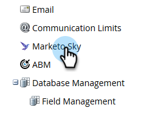

# Enabling Roles for Marketo Sky {#enabling-roles-for-marketo-sky}

Enabling Roles for Marketo Sky - Marketo Docs - Product Documentation

In order to utilize Marketo Sky, roles for desired users must be enabled.

>[!NOTE]
>
>**Admin Permissions Required**

##### 1. In Marketo Classic, click Admin. {#enablingrolesformarketosky-inmarketoclassic-clickadmin.}

##### 2. In the tree, select Marketo Sky. {#enablingrolesformarketosky-inthetree-selectmarketosky.}

##### 3. Select the desired role(s). {#enablingrolesformarketosky-selectthedesiredrole(s).}

The selected roles are now able to use Marketo Sky.
