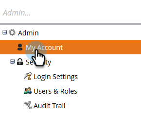
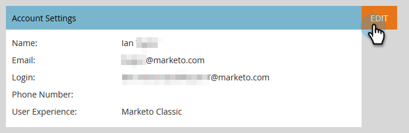
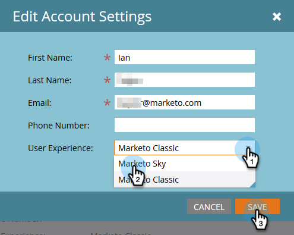

# How to Make Marketo Sky Your Default Experience {#how-to-make-marketo-sky-your-default-experience}

How to Make Marketo Sky Your Default Experience - Marketo Docs - Product Documentation

Making Marketo Sky your default experience is a simple process.

>[!NOTE]
>
>**Prerequisites**
>
>Your Marketo role must first be [enabled for Sky](http://docs.marketo.com/x/uIIOAQ).

##### 1. In Admin, click My Account. {#howtomakemarketoskyyourdefaultexperience-inadmin-clickmyaccount.}

##### 2. Under Account Settings, click Edit. {#howtomakemarketoskyyourdefaultexperience-underaccountsettings-clickedit.}

##### 3. In the User Experience drop-down, select Marketo Sky. Click Save. {#howtomakemarketoskyyourdefaultexperience-intheuserexperiencedrop-down-selectmarketosky.clicksave.}

And that's it. The next time you log-in, you'll be taken straight to the new My Marketo.
