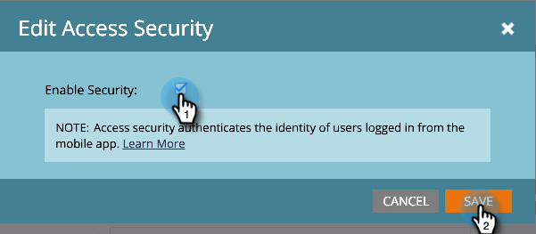

# Authenticate Mobile Access Security {#authenticate-mobile-access-security}

Authenticate Mobile Access Security - Marketo Docs - Product Documentation

To improve security for Mobile users, Marketo provides two new IDs: the Access Key and the Access Secret. These help to ensure that users logging into your app actually are who they appear to be.

To enable the IDs, you need to acquire the codes and provide them to your IT department so they can set up a secure match.

>[!NOTE]
>
>**Prerequisites**
>
>To enable this feature, contact Support and request "Vespa Secure Mode."

##### 1. In Marketo, select Admin and click Mobile Apps and Devices. {#authenticatemobileaccesssecurity-inmarketo-selectadminandclickmobileappsanddevices.}

##### 2. Select the Mobile App for which you want to enable secure access. {#authenticatemobileaccesssecurity-selectthemobileappforwhichyouwanttoenablesecureaccess.}

##### 3. Scroll down and in the Access Security section, click Edit. {#authenticatemobileaccesssecurity-scrolldownandintheaccesssecuritysection-clickedit.}

##### 4. Check the Enable Security checkbox. Click Save. {#authenticatemobileaccesssecurity-checktheenablesecuritycheckbox.clicksave.}

##### 5. The Access Security area now displays the two new codes. Be sure to send these to your IT department. {#authenticatemobileaccesssecurity-theaccesssecurityareanowdisplaysthetwonewcodes.besuretosendthesetoyouritdepartment.}

