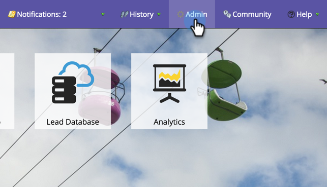

# Send SDK Code to a Developer {#send-sdk-code-to-a-developer}

Send SDK Code to a Developer - Marketo Docs - Product Documentation

Before you can create in-app messages or push notifications, you must have your developer set up and initialize the Mobile App SDK for the Android and iOS platforms.

* [Instructions for Android](http://developers.marketo.com/documentation/mobile/installation-instructions-on-android/)
* [Instructions for iOS](http://developers.marketo.com/documentation/mobile/installation-instructions-on-ios/)

#### Send SDK Code to a Developer {#sendsdkcodetoadeveloper-sendsdkcodetoadeveloper}

Sometimes, an admin needs to send some SDK code to a developer.

Here's how you do it.

##### 1. Click on Admin. {#sendsdkcodetoadeveloper-clickonadmin.}

  

##### 2. Select Mobile Apps. {#sendsdkcodetoadeveloper-selectmobileapps.}

 

##### 3. Select the desired mobile app. {#sendsdkcodetoadeveloper-selectthedesiredmobileapp.}

 

##### 4. Click Mobile App Actions and select Send to Developer. {#sendsdkcodetoadeveloper-clickmobileappactionsandselectsendtodeveloper.}

  

##### 5. Enter an email address and click SEND. {#sendsdkcodetoadeveloper-enteranemailaddressandclicksend.}

The SDK code will now be sent to your developer. 