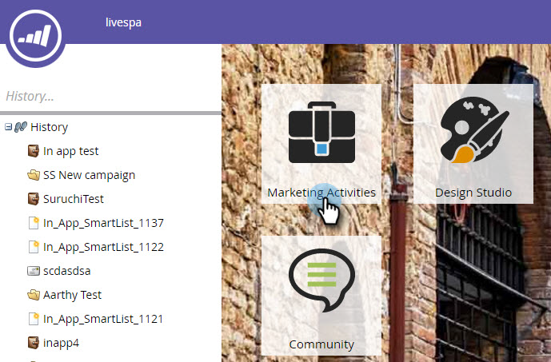
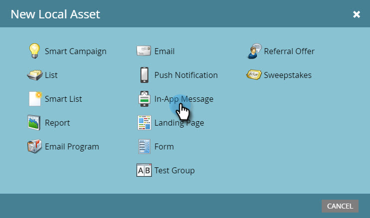
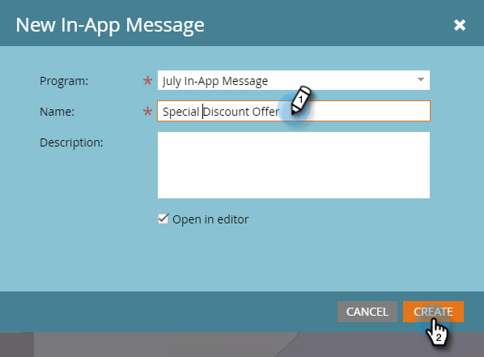

# Create an In-App Message {#create-an-in-app-message}

Create an In-App Message - Marketo Docs - Product Documentation

There are several steps to creating the perfect in-app message. Start here, and then follow the steps in order, in these articles.

After you create your in-app message, go [here](http://docs.marketo.com/pages/viewpage.action?pageid=10617378)to see how to send it.

* [Choose a Layout for Your In-App Message](create-an-in-app-message/choose-a-layout-for-your-in-app-message.md)
* [Add In-App Message Images](create-an-in-app-message/add-in-app-message-images.md)
* [Create In-App Message Text](create-an-in-app-message/create-in-app-message-text.md)
* [Set Up the In-App Message Button](create-an-in-app-message/set-up-the-in-app-message-button.md)
* [Set Up the In-App Message Background](create-an-in-app-message/set-up-the-in-app-message-background.md)
* [Set Up the Dismiss Button and Approve the Message](create-an-in-app-message/set-up-the-dismiss-button-and-approve-the-message.md)

##### 1. Go to Marketing Activities. {#createanin-appmessage-gotomarketingactivities.}

##### 2. Right-click a program and select New Local Asset.  {#createanin-appmessage-right-clickaprogramandselectnewlocalasset.}

##### 3. Select In App Message. {#createanin-appmessage-selectinappmessage.}

##### 4. Enter a name for the in-app message, provide an optional description, and click Create. {#createanin-appmessage-enteranameforthein-appmessage-provideanoptionaldescription-andclickcreate.}

>[!NOTE]
>
>The program name is automatically displayed in the drop-down, but you can select a different one.

Next, [choose a layout for your in-app message](create-an-in-app-message/choose-a-layout-for-your-in-app-message.md). 

>[!NOTE]
>
>**Related Articles**
>
>* [Understanding In-App Messages](understanding-in-app-messages.md)
>* [Send an In-App Message](http://docs.marketo.com/pages/viewpage.action?pageid=10617378)
>

