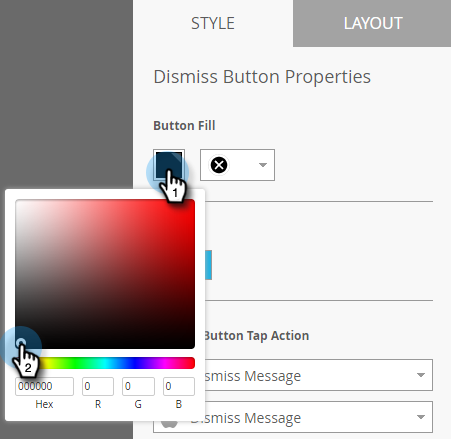
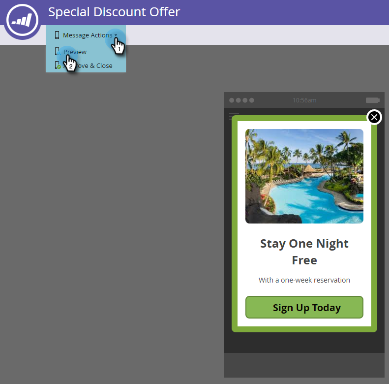

# Set Up the Dismiss Button and Approve the Message {#set-up-the-dismiss-button-and-approve-the-message}

Set Up the Dismiss Button and Approve the Message - Marketo Docs - Product Documentation

### What's in this article? {#what-s-in-this-article}

[Configure Dismiss Button Properties](#setupthedismissbuttonandapprovethemessage-configuredismissbuttonproperties)  
[Wrap it Up](#setupthedismissbuttonandapprovethemessage-wrapitup)

#### Configure Dismiss Button Properties  {#setupthedismissbuttonandapprovethemessage-configuredismissbuttonproperties}

The Dismiss button has many options to let you configure it the way you want.

##### 1. In the editor, click the Dismiss button. {#setupthedismissbuttonandapprovethemessage-intheeditor-clickthedismissbutton.}

##### 2. If you want to change the button color, click the color selection square. Select a color by clicking it or entering the Hex or RGB numbers on the color picker. Black is the default. {#setupthedismissbuttonandapprovethemessage-ifyouwanttochangethebuttoncolor-clickthecolorselectionsquare.selectacolorbyclickingitorenteringthehexorrgbnumbersonthecolorpicker.blackisthedefault.}

##### 3. Select a button design from the drop-down. Round buttons include a full color and a gradient option. {#setupthedismissbuttonandapprovethemessage-selectabuttondesignfromthedrop-down.roundbuttonsincludeafullcolorandagradientoption.}

>[!CAUTION]
>
>The button color may display as a white X on a white background when you select a different design from the drop-down. If so, simply select black or another color in the color selection square to make the white X visible.

##### 4. You can click the left corner button to move the dismiss button to the left (right side is the default). {#setupthedismissbuttonandapprovethemessage-youcanclicktheleftcornerbuttontomovethedismissbuttontotheleft(rightsideisthedefault).}

##### 5. Click the drop-down for each platform and select a tap action for the Dismiss button. {#setupthedismissbuttonandapprovethemessage-clickthedrop-downforeachplatformandselectatapactionforthedismissbutton.}

>[!NOTE]
>
>You must give the Dismiss button a tap action, so there's no check box to enable it. Dismiss Message is the default (and obvious) choice.

#### Wrap it Up {#setupthedismissbuttonandapprovethemessage-wrapitup}

All of your selections for the graphics, text, and buttons have been auto saved. Now, you're ready to finish the job.

##### 1. To preview your in-app message, click the Message Actions drop-down and select Preview. {#setupthedismissbuttonandapprovethemessage-topreviewyourin-appmessage-clickthemessageactionsdrop-downandselectpreview.}

##### 2. Preview the in-app message on phone or tablet to make sure it displays correctly. {#setupthedismissbuttonandapprovethemessage-previewthein-appmessageonphoneortablettomakesureitdisplayscorrectly.}

##### 3. If you're happy with the in-app message, click Approve & Close. {#setupthedismissbuttonandapprovethemessage-ifyou'rehappywiththein-appmessage-clickapprove&close.}

>[!NOTE]
>
>You can also select **Approve & Close** directly from the Message Actions drop-down (see step 1), but why not preview the message first, just to be safe?

##### 4. To close the editor without approving, simply close the tab. It's auto-saved, so you can return and approve it later. {#setupthedismissbuttonandapprovethemessage-toclosetheeditorwithoutapproving-simplyclosethetab.it'sauto-saved-soyoucanreturnandapproveitlater.}

So many choices, but now you've got a great-looking in-app message, ready to go!

Now it's time to [send your message](../../../../../welcome-to-marketo-docs/product-docs/mobile-marketing/in-app-messages/send-your-in-app-message.md).

>[!NOTE]
>
>**Related Articles**
>
>* [Understanding In-App Messages](../../../../../welcome-to-marketo-docs/product-docs/mobile-marketing/in-app-messages/understanding-in-app-messages.md)
>* [Send Your In-App Message](../../../../../welcome-to-marketo-docs/product-docs/mobile-marketing/in-app-messages/send-your-in-app-message.md)
>* [Choose a Layout for Your In-App Message](choose-a-layout-for-your-in-app-message.md)
>

