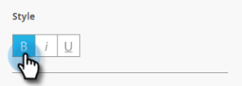

# Set Up the In-App Message Button {#set-up-the-in-app-message-button}

Set Up the In-App Message Button - Marketo Docs - Product Documentation

You can use the default button design, modify it, or upload your own custom button image.

##### 1. Click the button to open the Style tab for editing. {#setupthein-appmessagebutton-clickthebuttontoopenthestyletabforediting.}

##### 2. To change the color for the standard button, click the Color button. {#setupthein-appmessagebutton-tochangethecolorforthestandardbutton-clickthecolorbutton.}

##### 3. Click the color selection square and select the button color by clicking it or entering it the Hex or RGB numbers on the color picker. {#setupthein-appmessagebutton-clickthecolorselectionsquareandselectthebuttoncolorbyclickingitorenteringitthehexorrgbnumbersonthecolorpicker.}

##### 4. Select a shape in the drop-down. Standard shape choices include sharp corners, round corners, and gradients. {#setupthein-appmessagebutton-selectashapeinthedrop-down.standardshapechoicesincludesharpcorners-roundcorners-andgradients.}

##### 5. If you want to use your own image for a button, click the Image button, and click Select Image. {#setupthein-appmessagebutton-ifyouwanttouseyourownimageforabutton-clicktheimagebutton-andclickselectimage.}

##### 6. Choose the image and click Select. {#setupthein-appmessagebutton-choosetheimageandclickselect.}

>[!TIP]
>
>When placing a custom image for the button, consider clearing the placeholder text laid over it if your image includes text already.

##### 7. Click the color selection square and then select the font color by clicking it or entering Hex or RGB numbers on the color picker. {#setupthein-appmessagebutton-clickthecolorselectionsquareandthenselectthefontcolorbyclickingitorenteringhexorrgbnumbersonthecolorpicker.}

##### 8. Click the arrows to choose the font size. {#setupthein-appmessagebutton-clickthearrowstochoosethefontsize.}

##### 9. Choose font style for emphasis: Bold, *Italic*, or Underline. {#setupthein-appmessagebutton-choosefontstyleforemphasis-bold-italic-orunderline.}

##### 10. Click the button text to edit it inline. {#setupthein-appmessagebutton-clickthebuttontexttoedititinline.}

##### 11. Check the box to set the button tap action. {#setupthein-appmessagebutton-checktheboxtosetthebuttontapaction.}

Click the drop-down for each platform and select a tap action.

>[!NOTE]
>
>**Reminder**
>
>The button always has a tap action, so the Tap Action checkbox is automatically selected, with the default message "Dismiss Message."

Almost there. Your last step is to [configure your in-app message background and dismiss button](set-up-the-in-app-message-background.md). 

>[!NOTE]
>
>**Related Articles**
>
>* [Understanding In-App Messages](../../../../../welcome-to-marketo-docs/product-docs/mobile-marketing/in-app-messages/understanding-in-app-messages.md)
>* [Choose a Layout for Your In-App Message](choose-a-layout-for-your-in-app-message.md)
>

