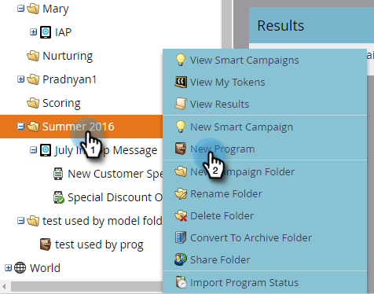
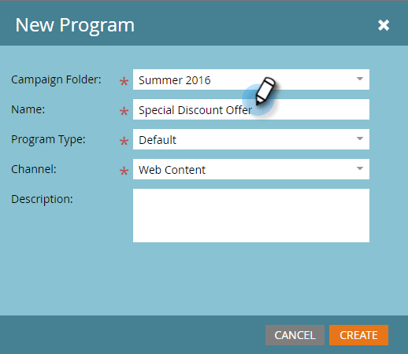
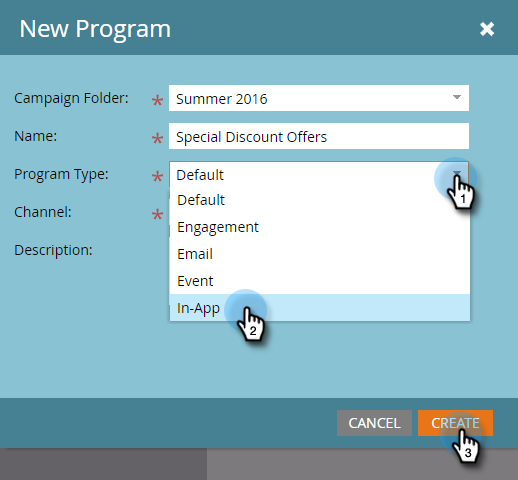
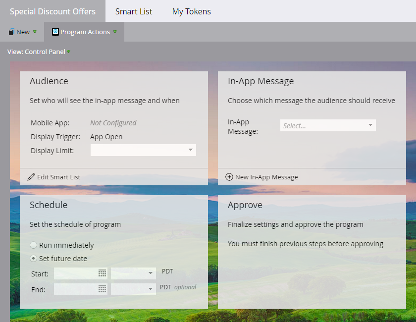

# Send Your In-App Message {#send-your-in-app-message}

Send Your In-App Message - Marketo Docs - Product Documentation

After you've [created your in-app message](create-an-in-app-message.md), it's time to send it out. Here are the steps:

* [Set Your In-App Message Audience](send-your-in-app-message/set-your-in-app-message-audience.md)
* [Select Your In-App Message](send-your-in-app-message/select-your-in-app-message.md)
* [Schedule Your In-App Message](send-your-in-app-message/schedule-your-in-app-message.md)
* [Approve Your In-App Message](send-your-in-app-message/approve-your-in-app-message.md)

>[!NOTE]
>
>When you're testing an in-app message triggered by **App Open**, be sure you download the app onto the phone, open it and close it. This initializes the SDK code. The *next* time you open the app, the in-app message will display. Custom events trigger the first time the app is opened.

Here's how to get started. 

##### 1. In Marketing Activities, click the folder where you want the program to live and choose New Program. {#sendyourin-appmessage-inmarketingactivities-clickthefolderwhereyouwanttheprogramtoliveandchoosenewprogram.}

##### 2. Enter a name. {#sendyourin-appmessage-enteraname.}

##### 3. Select the In-App program type from the drop-down and click Create. {#sendyourin-appmessage-selectthein-appprogramtypefromthedrop-downandclickcreate.}

##### 4. Use the Control Panel to define the who, what, and when of the in-app message, and when you're done, approve it. There's a separate article for each step. {#sendyourin-appmessage-usethecontrolpaneltodefinethewho-what-andwhenofthein-appmessage-andwhenyou'redone-approveit.there'saseparatearticleforeachstep.}

Ready? Start with [setting the audience](send-your-in-app-message/set-your-in-app-message-audience.md).

>[!NOTE]
>
>**Related Articles**
>
>* [Understanding In-App Messages](understanding-in-app-messages.md)
>

