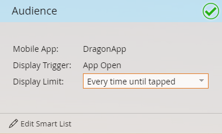

# Set Your In-App Message Audience {#set-your-in-app-message-audience}

Set Your In-App Message Audience - Marketo Docs - Product Documentation

The first step is to decide who should receive your in-app message. You need to set up your smart list.

##### 1. Click Edit Smart List. {#setyourin-appmessageaudience-clickeditsmartlist.}

##### 2. In the Smart List, the Has Mobile App Activity trigger is automatically populated. Click the drop-down and select the app you want to place the message in. {#setyourin-appmessageaudience-inthesmartlist-thehasmobileappactivitytriggerisautomaticallypopulated.clickthedrop-downandselecttheappyouwanttoplacethemessagein.}

>[!NOTE]
>
>Multiple values for the Mobile App field are not currently supported for in-app message programs.

##### 3. App Open is the default Action setting, but you can select any custom event you've already set up. {#setyourin-appmessageaudience-appopenisthedefaultactionsetting-butyoucanselectanycustomeventyou'vealreadysetup.}

>[!NOTE]
>
>The default trigger (App Open) and any custom triggers added to the code by your developer are automatically shown in the Action selector. If a custom event is missing, check with your developer to ensure they have added the custom events to the app. Be aware that the custom event coding and approval process may take some time to complete. See [this article](../../../../../welcome-to-marketo-docs/product-docs/mobile-marketing/admin-(mobile-marketing)/before-you-create-push-notifications-and-in-app-messages.md) for more information.

##### 4. Constraints are available for the Has Mobile App Activity trigger if you need them. {#setyourin-appmessageaudience-constraintsareavailableforthehasmobileappactivitytriggerifyouneedthem.}

##### 5. You can add filters to your smart list to limit who receives your in-app message. In this example,using the Acquisition Date filter, only people acquired on June 9, 2016 will be sent the in-app message. {#setyourin-appmessageaudience-youcanaddfilterstoyoursmartlisttolimitwhoreceivesyourin-appmessage.inthisexample-usingtheacquisitiondatefilter-onlypeopleacquiredonjune9-2016willbesentthein-appmessage.}

##### 6. Return to your in-app message Control Panel. Set the display limit in the drop-down. {#setyourin-appmessageaudience-returntoyourin-appmessagecontrolpanel.setthedisplaylimitinthedrop-down.}

>[!NOTE]
>
>The default display limit is **Once per session**. If you want the message to stop displaying after the recipient responds, select `**Every time until tapped**`. If it should display every time, no matter what the recipient does, pick **Every time**.

Nice work! You've got your audience set. You've earned the blue bar and green check mark.   

Time to [select your in-app message](select-your-in-app-message.md)!
