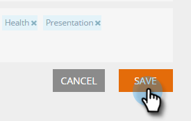

# Set Up Categories {#set-up-categories}

Set Up Categories - Marketo Docs - Product Documentation

>[!NOTE]
>
>Depending on the purchase date, your Marketo subscription may include either Marketo Predictive Content or Content`AI`. For those using Predictive Content, Marketo is enabling Content`AI` Analytics features until April 30, 2018. To keep these features beyond that date, please contact your Marketo Customer Success Manager to upgrade to Marketo Content`AI`.

Create categories in Predictive Content to group your predictive outcomes on web or email. For example, you can work only with blogs, or with content in a particular language. It also lets you search and filter your page view.  Categories are displayed on the All Content and Predictive Content pages for easy reference.

When you edit discovered content, add categories in the edit screen. Click the **Categories** field and select them from the drop-down.

When you add content, you can tag it with categories selected on the pop-up.

#### Create Category Tags {#setupcategories-createcategorytags}

Here's how to create category tags.

##### 1. Go to Content Settings. {#setupcategories-gotocontentsettings.}

##### 2. Click Categories. {#setupcategories-clickcategories.}

##### 3. Existing category tags are displayed. Enter a new category tag and click Create New. {#setupcategories-existingcategorytagsaredisplayed.enteranewcategorytagandclickcreatenew.}

##### 4. You can remove a category tag by clicking the x next to it. {#setupcategories-youcanremoveacategorytagbyclickingthexnexttoit.}

##### 5. Click Save when you're done. {#setupcategories-clicksavewhenyou'redone.}

Pretty simple.
