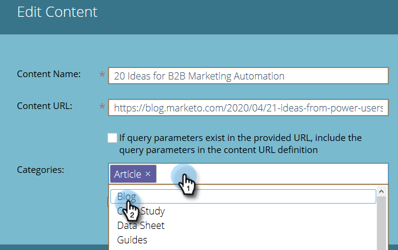

# Edit Content {#edit-content}

Edit Content - Marketo Docs - Product Documentation

You can make some edits to listings on the All Content Page.

##### 1. On the All Content page, hover over the row of the title you want to edit and click the edit icon. {#editcontent-ontheallcontentpage-hoverovertherowofthetitleyouwanttoeditandclicktheediticon.}

##### 2. Make changes to the Content Title and Content URL (query parameters checkbox is optional).  {#editcontent-makechangestothecontenttitleandcontenturl(queryparameterscheckboxisoptional).}

##### 3. Click the Categories field to add/remove categories. Select new ones from the drop-down. You can remove a currently selected category by clicking its X. {#editcontent-clickthecategoriesfieldtoadd/removecategories.selectnewonesfromthedrop-down.youcanremoveacurrentlyselectedcategorybyclickingitsx.}

##### 4. Check the Approve for Predictive Content box to approve, or uncheck the box to unapprove. Click Save when done. {#editcontent-checktheapproveforpredictivecontentboxtoapprove-orunchecktheboxtounapprove.clicksavewhendone.}

