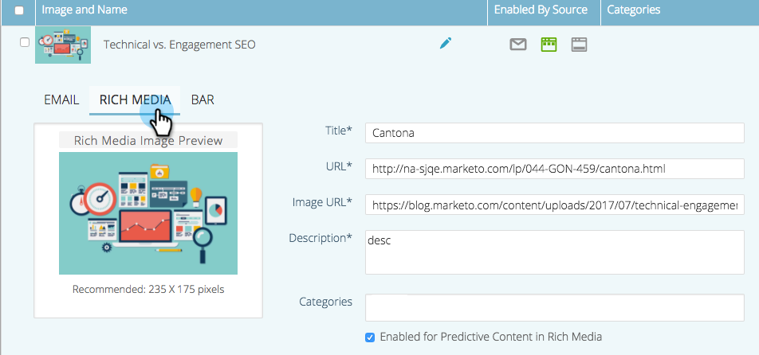
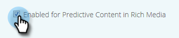

# Edit Predictive Content for Rich Media {#edit-predictive-content-for-rich-media}

Edit Predictive Content for Rich Media - Marketo Docs - Product Documentation

>[!NOTE]
>
>Depending on the purchase date, your Marketo subscription may include either Marketo Predictive Content or Content`AI`. For those using Predictive Content, Marketo is enabling Content`AI` Analytics features until April 30, 2018. To keep these features beyond that date, please contact your Marketo Customer Success Manager to upgrade to Marketo Content`AI`.

Here's how to set up your predictive content for Rich Media. 

>[!NOTE]
>
>**Prerequisites**
>
>Content must be [approved for predictive content](../../../../../welcome-to-marketo-docs/product-docs/predictive-content/working-with-all-content/approve-a-title-for-predictive-content.md) on the All Content page.

##### 1. On the Predictive Content page, click a title to open the editor. {#editpredictivecontentforrichmedia-onthepredictivecontentpage-clickatitletoopentheeditor.}

##### 2. Click Rich Media. {#editpredictivecontentforrichmedia-clickrichmedia.}

##### 3. You'll notice you can have separate images for Email and Rich Media. To add/change the image, paste the image URL into its text box. {#editpredictivecontentforrichmedia-you'llnoticeyoucanhaveseparateimagesforemailandrichmedia.toadd/changetheimage-pastetheimageurlintoitstextbox.}

##### 4. Type in a Description.  {#editpredictivecontentforrichmedia-typeinadescription.}

##### 5. Click the Categories box to select/add [categories you've already set up](../../../../../welcome-to-marketo-docs/product-docs/predictive-content/getting-started-(predictive-content-and-content-ai)/set-up-categories.md) (optional).  
{#editpredictivecontentforrichmedia-clickthecategoriesboxtoselect/addcategoriesyou'vealreadysetup(optional).}

>[!NOTE]
>
>Use categories to group content for a specific Rich Media recommendation template. Leave the category empty to apply the content to all recommendation templates (recommended).
>
>However, if you want to recommend only specific content for a Rich Media template, add a category for the content and associate that category with the recommendation template.
>
>For example, categorize relevant content according to sections of your website (products or solutions).

##### 6. Check the box to enable Predictive Content in Rich Media. {#editpredictivecontentforrichmedia-checktheboxtoenablepredictivecontentinrichmedia.}

##### 7. Click Save. {#editpredictivecontentforrichmedia-clicksave.}

