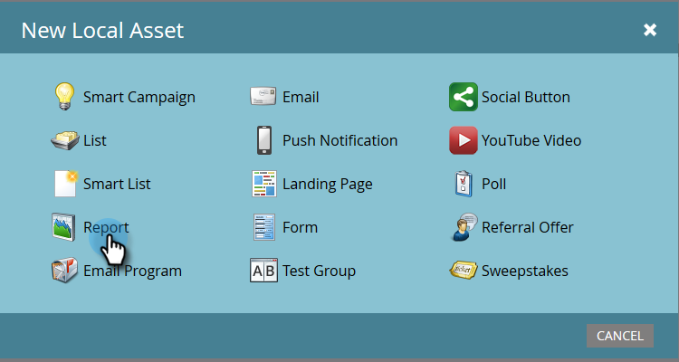

# Build a People Performance Report with Mobile Platform Columns {#build-a-people-performance-report-with-mobile-platform-columns}

Build a People Performance Report with Mobile Platform Columns - Marketo Docs - Product Documentation

Follow these steps to create a People Performance Report with mobile platform (iOS/Android) columns.

>[!NOTE]
>
>**FYI**
>
>Marketo is now standardizing language across all subscriptions, so you may see lead/leads in your subscription and person/people in docs.marketo.com. These terms mean the same thing; it does not affect article instructions. There are some other changes, too. [Learn more](http://docs.marketo.com/display/DOCS/Updates+to+Marketo+Terminology).

### What's in this article? {#what-s-in-this-article}

[Create Mobile Smart Lists](#buildapeopleperformancereportwithmobileplatformcolumns-createmobilesmartlists)  
[Create a People Performance Report](#buildapeopleperformancereportwithmobileplatformcolumns-createapeopleperformancereport)  
[Add Mobile Smart Lists as Columns](#buildapeopleperformancereportwithmobileplatformcolumns-addmobilesmartlistsascolumns)

#### Create Mobile Smart Lists {#buildapeopleperformancereportwithmobileplatformcolumns-createmobilesmartlists}

##### 1. Go to Marketing Activities. {#buildapeopleperformancereportwithmobileplatformcolumns-gotomarketingactivities.}

##### 2. Choose a program. {#buildapeopleperformancereportwithmobileplatformcolumns-chooseaprogram.}

##### 3. Under New, select New Local Asset. {#buildapeopleperformancereportwithmobileplatformcolumns-undernew-selectnewlocalasset.}

##### 4. Click Smart List. {#buildapeopleperformancereportwithmobileplatformcolumns-clicksmartlist.}

##### 5. Type in a name and click Create. {#buildapeopleperformancereportwithmobileplatformcolumns-typeinanameandclickcreate.}

##### 6. Find and drag the Opened Email filter into the canvas. {#buildapeopleperformancereportwithmobileplatformcolumns-findanddragtheopenedemailfilterintothecanvas.}

##### 7. Set Email to is any. {#buildapeopleperformancereportwithmobileplatformcolumns-setemailtoisany.}

##### 8. Click on Add Constraint and select Platform. {#buildapeopleperformancereportwithmobileplatformcolumns-clickonaddconstraintandselectplatform.}

>[!TIP]
>
>We used the Opened Email filter in this example. You can also use the Clicked Email filter as it has the Platform constraint.

##### 9. Set Platform to iOS. {#buildapeopleperformancereportwithmobileplatformcolumns-setplatformtoios.}

>[!NOTE]
>
>At least one person must have opened one of your emails on an iOS device in order for Marketo's autosuggest to find it. If it does not come up, you can manually type it in and save.

Now create a second smart list for the "Android" platform. Once that's done, move on to the next section.

#### Create a People Performance Report {#buildapeopleperformancereportwithmobileplatformcolumns-createapeopleperformancereport}

##### 1. Under Marketing Activities, select the program that is housing your iOS and Android smart lists. {#buildapeopleperformancereportwithmobileplatformcolumns-undermarketingactivities-selecttheprogramthatishousingyouriosandandroidsmartlists.}

##### 2. Under New, select New Local Asset. {#buildapeopleperformancereportwithmobileplatformcolumns-undernew-selectnewlocalasset..1}

##### 3. Click Report. {#buildapeopleperformancereportwithmobileplatformcolumns-clickreport.}

##### 4. Set Type to People Performance. {#buildapeopleperformancereportwithmobileplatformcolumns-settypetopeopleperformance.}

##### 5. Click Create. {#buildapeopleperformancereportwithmobileplatformcolumns-clickcreate.}

You're doing great! Now on to the next section.

#### Add Mobile Smart Lists as Columns {#buildapeopleperformancereportwithmobileplatformcolumns-addmobilesmartlistsascolumns}

##### 1. In the report you just created, click Setup, then drag Custom Columns into the canvas. {#buildapeopleperformancereportwithmobileplatformcolumns-inthereportyoujustcreated-clicksetup-thendragcustomcolumnsintothecanvas.}

>[!NOTE]
>
>By default the People Performance report is looking at the Last 7 days. You can change the timeframe by double-clicking on it.

##### 2. Find and select the smart lists you created earlier and click Apply. {#buildapeopleperformancereportwithmobileplatformcolumns-findandselectthesmartlistsyoucreatedearlierandclickapply.}

##### 3. Click Report to run the report and see your data. {#buildapeopleperformancereportwithmobileplatformcolumns-clickreporttorunthereportandseeyourdata.}

Pretty cool, right? Nicely done!
