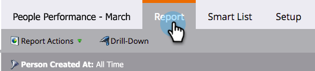

# Drill Down in a People Performance Report {#drill-down-in-a-people-performance-report}

Drill Down in a People Performance Report - Marketo Docs - Product Documentation

Drill down in a People Performance Report to see additional person information.

>[!NOTE]
>
>**FYI**
>
>Marketo is now standardizing language across all subscriptions, so you may see lead/leads in your subscription and person/people in docs.marketo.com. These terms mean the same thing; it does not affect article instructions. There are some other changes, too. [Learn more](http://docs.marketo.com/display/DOCS/Updates+to+Marketo+Terminology).

##### 1. Click the Report tab to view any existing report. {#drilldowninapeopleperformancereport-clickthereporttabtoviewanyexistingreport.}

##### 2. Select a row in the report that you would like to learn more about. {#drilldowninapeopleperformancereport-selectarowinthereportthatyouwouldliketolearnmoreabout.}

##### 3. Click on Drill-Down. {#drilldowninapeopleperformancereport-clickondrill-down.}

##### 4. In the Drill-Down pop-up, select the attribute you would like to drill down to. Then click Drill-Down. {#drilldowninapeopleperformancereport-inthedrill-downpop-up-selecttheattributeyouwouldliketodrilldownto.thenclickdrill-down.}

##### 5. Great job! The drill-down report will open in a new tab. Now you can explore the new report. {#drilldowninapeopleperformancereport-greatjob!thedrill-downreportwillopeninanewtab.nowyoucanexplorethenewreport.}

>[!TIP]
>
>If you don't see a new report tab open, your browser might be blocking pop-ups. Change your browser settings to allow it.

  

##### 6. To save your results (optional), click the Export icon on the bottom-left. {#drilldowninapeopleperformancereport-tosaveyourresults(optional)-clicktheexporticononthebottom-left.}

