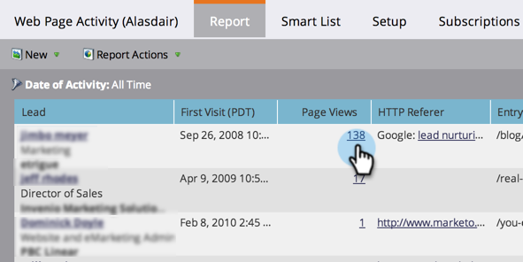

# Web Pages Viewed, Web Page Activity Report {#web-pages-viewed-web-page-activity-report}

Web Pages Viewed, Web Page Activity Report - Marketo Docs - Product Documentation

From a [Web Page Activity report](../../../../../../welcome-to-marketo-docs/product-docs/reporting/basic-reporting/report-types/web-page-activity-report.md), you can see the specific pages that were viewed by the people in the report.

>[!NOTE]
>
>**Prerequisites**
>
>`To capture activity from your web site in Marketo, you first need to` [set up Munchkin on your site](../../../../../../welcome-to-marketo-docs/product-docs/administration/additional-integrations/add-munchkin-tracking-code-to-your-website.md) `.`

1. In your [Web Page Activity report](../../../../../../welcome-to-marketo-docs/product-docs/reporting/basic-reporting/report-types/web-page-activity-report.md), click the number in the Page Views column.

   

1. You're there! A new window opens, showing the list of pages on your site that the person visited, and when.

   

   >[!NOTE]
   >
   >**Related Articles**
   >
   >
   >`Create a` [Company Web Activity report](../../../../../../welcome-to-marketo-docs/product-docs/reporting/basic-reporting/report-types/company-web-activity-report.md) `to see which companies are visiting your site.`

   >[!NOTE]
   >
   >**Deep Dive**
   >
   >
   >`Do more with reports! See the` [Basic Reporting](../../../../../../welcome-to-marketo-docs/product-docs/reporting/basic-reporting.md) `deep dive.`

