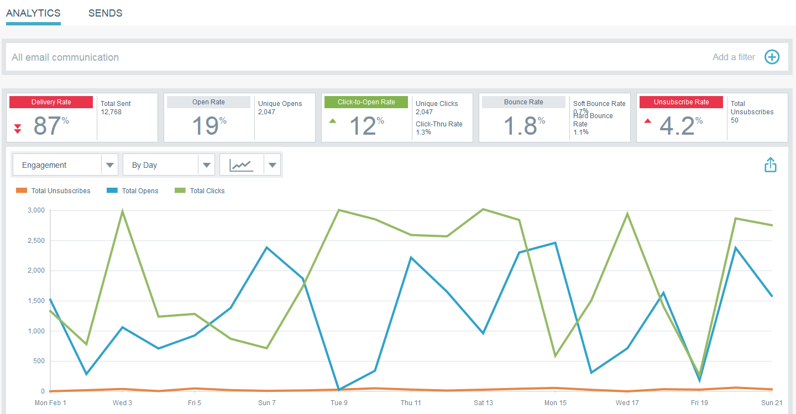
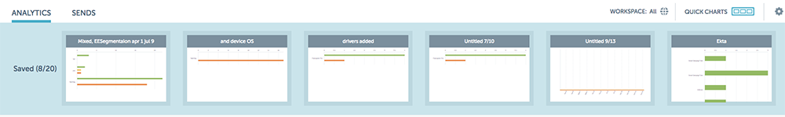

# Email Insights Quick Charts {#email-insights-quick-charts}

Email Insights Quick Charts - Marketo Docs - Product Documentation

Quick Charts are thumbnails that you customize and save, providing a quick view of charts that you use the most.

### What's in this article? {#what-s-in-this-article}

[Create a New Quick Chart](#emailinsightsquickcharts-createanewquickchart)  
[Delete a Quick Chart](#emailinsightsquickcharts-deleteaquickchart)

#### Create a New Quick Chart {#emailinsightsquickcharts-createanewquickchart}

In this example, we'll choose open rate for the first three weeks of February, 2016, in the states of California and Florida.

##### 1. Click the date filter on the right of the Analytics screen. {#emailinsightsquickcharts-clickthedatefilterontherightoftheanalyticsscreen.}

##### 2. Choose your desired date range. {#emailinsightsquickcharts-chooseyourdesireddaterange.}

##### 3. When your date range is selected, click Apply. {#emailinsightsquickcharts-whenyourdaterangeisselected-clickapply.}

##### 4. The chart changes after your dates have been applied. {#emailinsightsquickcharts-thechartchangesafteryourdateshavebeenapplied.}

##### 5. Click the first drop-down. Click to select your criteria (if it isn't selected already) and deselect any undesired criteria. {#emailinsightsquickcharts-clickthefirstdrop-down.clicktoselectyourcriteria(ifitisn'tselectedalready)anddeselectanyundesiredcriteria.}

##### 6. On the right-hand side of the chart, click the export icon and select Save as Quick Chart. {#emailinsightsquickcharts-ontheright-handsideofthechart-clicktheexporticonandselectsaveasquickchart.}

##### 7. Name your Quick Chart and click Save. {#emailinsightsquickcharts-nameyourquickchartandclicksave.}

>[!NOTE]
>
>You can have up to 20 Quick Charts. They can be deleted and replaced.

##### 8. Your new Quick Chart will appear with the others. {#emailinsightsquickcharts-yournewquickchartwillappearwiththeothers.}

And that's it!

>[!TIP]
>
>To move any quick chart, simply click and drag it to the desired position.

#### Delete a Quick Chart {#emailinsightsquickcharts-deleteaquickchart}

Want to delete one of your Quick Charts? It's easy!

##### 1. Click the Quick Charts icon. {#emailinsightsquickcharts-clickthequickchartsicon.}

##### 2. Hover over the desired chart, but do not click on it. Upon hovering, an X will appear. Click the X. {#emailinsightsquickcharts-hoveroverthedesiredchart-butdonotclickonit.uponhovering-anxwillappear.clickthex.}

##### 3. Click Ok. {#emailinsightsquickcharts-clickok.}

Your Quick Chart is now deleted. Told you it was easy.
