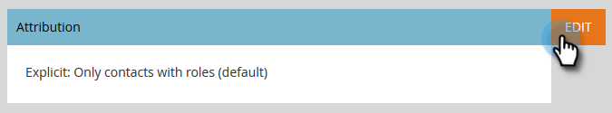
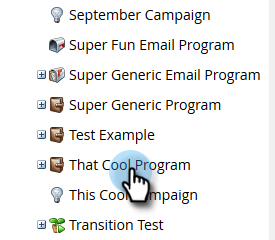
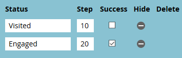

# Setting Up Performance Insights {#setting-up-performance-insights}

Setting Up Performance Insights - Marketo Docs - Product Documentation

Follow the steps below to set up MPI.

### What's in this article? {#what-s-in-this-article}

[Opportunity Setup](#settingupperformanceinsights-opportunitysetup)  
[Program Setup](#settingupperformanceinsights-programsetup)  
[Tie the Program to the Person](#settingupperformanceinsights-tietheprogramtotheperson)

#### Opportunity Setup {#settingupperformanceinsights-opportunitysetup}

##### 1. Click Admin. {#settingupperformanceinsights-clickadmin.}

##### 2. Click Revenue Cycle Analytics. {#settingupperformanceinsights-clickrevenuecycleanalytics.}

>[!NOTE]
>
>If you do not have RCA, you'll need to select **Program Analysis** for Step 2.

##### 3. Under Attribution, click Edit. {#settingupperformanceinsights-underattribution-clickedit.}

##### 4. Attribution Settings displays. {#settingupperformanceinsights-attributionsettingsdisplays.}

If Attribution is explicit, ensure the Opportunity Contact Role has been populated (either via the Opportunity Role endpoint or via CRM integration).

If Attribution is implicit, ensure the company field on the lead/contact is the same as the Account Name of the opportunity.

>[!NOTE]
>
>Ensure all of the opportunities have the appropriate fields populated:
>
>* Opportunity Amount
>* Is Closed
>* Is Won
>* Creation Date (this may not be set in your case)
>* Closed Date (this may not be set in your case)
>* Opportunity Type
>

#### Program Setup {#settingupperformanceinsights-programsetup}

Update the program costs for at least 12 months. You can do this manually or using the program API. In this example we do it manually.

##### 1. Click Marketing Activities. {#settingupperformanceinsights-clickmarketingactivities.}

##### 2. Find and select your program. {#settingupperformanceinsights-findandselectyourprogram.}

##### 3. Click the Setup tab. {#settingupperformanceinsights-clickthesetuptab.}

##### 4. Drag Period Cost onto the canvas. {#settingupperformanceinsights-dragperiodcostontothecanvas.}

##### 5. Set the Program Month for at least 12 months ago and click Ok. {#settingupperformanceinsights-settheprogrammonthforatleast12monthsagoandclickok.}

##### 6. Set the period cost and click Save. {#settingupperformanceinsights-settheperiodcostandclicksave.}

Next, review the analytics behavior to indicate whether particular channel should be included in analytics. Set the Analytics Behavior (Normal, Inclusive, Operational).

##### 1. Click Admin. {#settingupperformanceinsights-clickadmin..1}

##### 2. Click Tags. {#settingupperformanceinsights-clicktags.}

##### 3. Click the + to expand the Channel list. {#settingupperformanceinsights-clickthe+toexpandthechannellist.}

##### 4. Double-click the desired channel. {#settingupperformanceinsights-double-clickthedesiredchannel.}

##### 5. Click the Analytics Behavior drop-down and select the desired behavior. {#settingupperformanceinsights-clicktheanalyticsbehaviordrop-downandselectthedesiredbehavior.}

##### 6. Set the success criteria. {#settingupperformanceinsights-setthesuccesscriteria.}

##### 7. Click Save. {#settingupperformanceinsights-clicksave.}

#### Tie the Program to the Person {#settingupperformanceinsights-tietheprogramtotheperson}

##### 1. Make sure Acquisition Program and Acquisition Date have been set for each person in your database in order for First Touch Attribution to work. {#settingupperformanceinsights-makesureacquisitionprogramandacquisitiondatehavebeensetforeachpersoninyourdatabaseinorderforfirsttouchattributiontowork.}

##### 2. Ensure your programs are setting success states for your people. {#settingupperformanceinsights-ensureyourprogramsaresettingsuccessstatesforyourpeople.}

>[!NOTE]
>
>Changes made are not instantaneous. An overnight period is required before changes go into effect.

