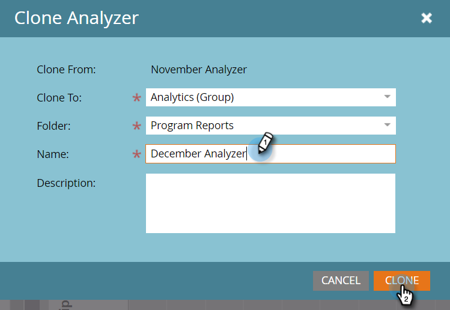

# Clone a Program Analyzer {#clone-a-program-analyzer}

Clone a Program Analyzer - Marketo Docs - Product Documentation

After you've saved an analyzer, it's easy to clone it to create a new one. Then, go in and edit the new one if it needs any changes.

1. Click the **Analytics **tile.

   

   ##### Click the Program Analyzer tile. {#cloneaprogramanalyzer-clicktheprogramanalyzertile.}

   

   ##### While your saved analyzer is open, open the Analyzer Actions drop-down and select Clone Analyzer. {#cloneaprogramanalyzer-whileyoursavedanalyzerisopen-opentheanalyzeractionsdrop-downandselectcloneanalyzer.}

   

   ##### Select the location for the cloned analyzer from the Clone To and Folder drop-downs. {#cloneaprogramanalyzer-selectthelocationfortheclonedanalyzerfromtheclonetoandfolderdrop-downs.}

   

   ##### Name the cloned analyzer and click Clone. {#cloneaprogramanalyzer-nametheclonedanalyzerandclickclone.}

   

   ##### Now, you've got two identical analyzers with different names. Open the clone to make any necessary changes. {#cloneaprogramanalyzer-now-you'vegottwoidenticalanalyzerswithdifferentnames.opentheclonetomakeanynecessarychanges.}

   

   >[!NOTE]
   >
   >**Related Articles**
   >
   >    
   >    
   >    * [Create a Program Analyzer](create-a-program-analyzer.md)
   >    
   >

