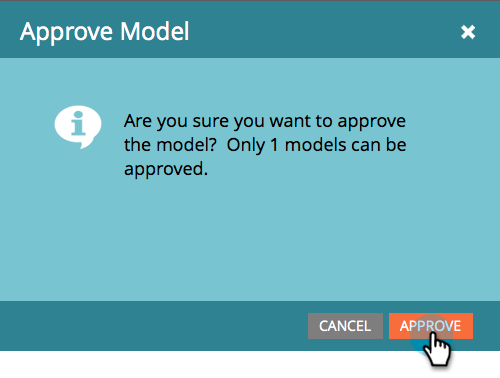

# Approve/Unapprove a Revenue Model {#approve-unapprove-a-revenue-model}

Approve/Unapprove a Revenue Model - Marketo Docs - Product Documentation

You may only have one approved model at any given time.

>[!NOTE]
>
>**FYI**
>
>Marketo is now standardizing language across all subscriptions, so you may see lead/leads in your subscription and person/people in docs.marketo.com. These terms mean the same thing; it does not affect article instructions. There are some other changes, too. [Learn more](http://docs.marketo.com/display/DOCS/Updates+to+Marketo+Terminology).

### What's in this article? {#what-s-in-this-article}

[Approve](#approve/unapprovearevenuemodel-approve)  
[Unapprove](#approve/unapprovearevenuemodel-unapprove)

>[!CAUTION]
>
>[Individual stages must be approved](../../../../../../welcome-to-marketo-docs/product-docs/reporting/revenue-cycle-analytics/revenue-cycle-models/approving-stages-and-assigning-leads-to-a-revenue-model.md) and people added before you approve an entire model.

#### Approve {#approve/unapprovearevenuemodel-approve}

##### 1. Go to the Analytics area. {#approve/unapprovearevenuemodel-gototheanalyticsarea.}

##### 2. Select a model from the tree. {#approve/unapprovearevenuemodel-selectamodelfromthetree.}

##### 3. From the Model Actions menu, choose Approve Model. {#approve/unapprovearevenuemodel-fromthemodelactionsmenu-chooseapprovemodel.}

##### 4. A dialog appears to confirm your choice. Click Approve. {#approve/unapprovearevenuemodel-adialogappearstoconfirmyourchoice.clickapprove.}

Your model is now live!

#### Unapprove {#approve/unapprovearevenuemodel-unapprove}

>[!CAUTION]
>
>If you unapprove your model all of your people are removed from the model, and their history in the model is deleted!

##### 1. Go to the Analytics area. {#approve/unapprovearevenuemodel-gototheanalyticsarea..1}

##### 2. Select a model from the tree.  {#approve/unapprovearevenuemodel-selectamodelfromthetree..1}

##### 3. Click the Model Actions menu and choose Unapprove Model.  {#approve/unapprovearevenuemodel-clickthemodelactionsmenuandchooseunapprovemodel.}

##### 4. In the dialog that appears, click Unapprove Model.  {#approve/unapprovearevenuemodel-inthedialogthatappears-clickunapprovemodel.}

`Congrats! Your model is now unapproved.`

>[!CAUTION]
>
>Unapproving a model removes all your people from the model, and removes their history in the model from the database.

