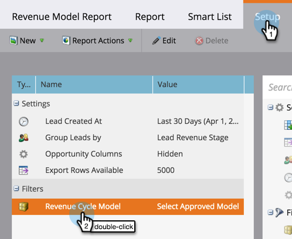

# Report on Your Revenue Model {#report-on-your-revenue-model}

Report on Your Revenue Model - Marketo Docs - Product Documentation

For each revenue cycle model, you can generate a report on how many leads are in each stage.

>[!NOTE]
>
>Leads must be members of the model to be included in the report.

1. Go to **Analytics**.

   

1. Click **Leads by Revenue Stage**.

   

   ##### Click on the Setup tab and then underneath the filter section double-click Revenue Cycle Model. {#reportonyourrevenuemodel-clickonthesetuptabandthenunderneaththefiltersectiondouble-clickrevenuecyclemodel.}

   

   ##### Select the approved Model. {#reportonyourrevenuemodel-selecttheapprovedmodel.}

   

   >[!NOTE]
   >
   >To be available from this drop-down menu, the model must be approved, or at least have approved stages.

1. Click the **Report** tab to see how many leads are in each stage of your revenue cycle model.

   

Why is this useful? The model shows your sales and marketing funnel. Keep track of their balances over time to identify bottlenecks before they become a problem.
