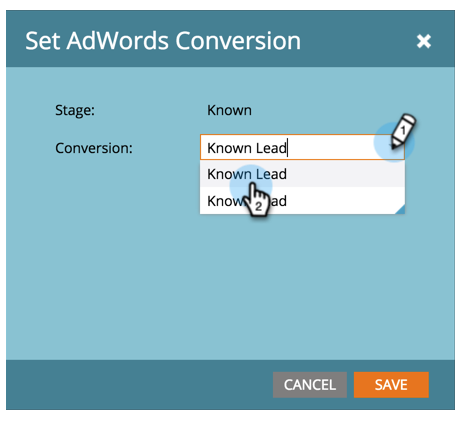
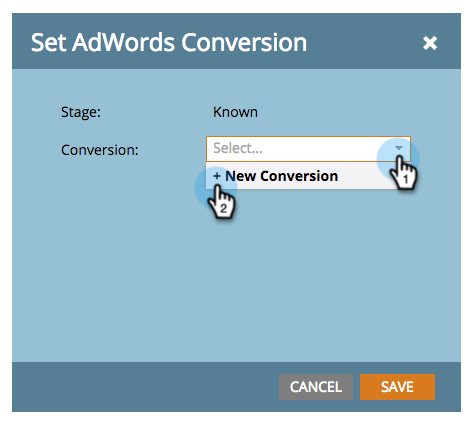

# Set Google AdWords Conversions in the Revenue Model {#set-google-adwords-conversions-in-the-revenue-model}

Set Google AdWords Conversions in the Revenue Model - Marketo Docs - Product Documentation

Link your Google AdWords account to Marketo to automatically upload offline conversion data from Marketo to Google AdWords. Then, from the AdWords UI, you will be able to easily see which clicks resulted in qualified leads, opportunities and new customers (or whatever revenue stages you want to track) `after you` [add custom columns](https://support.google.com/adwords/answer/3073556) `in AdWords`.

>[!NOTE]
>
>This is a push integration from Marketo to Google AdWords. Conversion data will appear *only* in your Google AdWords portal,** not in the Marketo UI. **

`Learn more about` [Google’s offline conversion import feature](https://support.google.com/adwords/answer/2998031?hl=en) `.`  Map AdWords offline conversions to one or more stages in a Revenue model. There are three ways to do the mapping:

* 
  AdWords Conversion 
* 
  Stage Action 
* `AdWords Mapping`

You can create a new AdWords offline conversion from Marketo if you use Stage Action.

>[!NOTE]
>
>**Prerequisites**
>
>* [Add Google AdWords as a LaunchPoint Service](../../../../../welcome-to-marketo-docs/product-docs/administration/additional-integrations/add-google-adwords-as-a-launchpoint-service.md)
>

### What's in this article? {#what-s-in-this-article}

[Use AdWords Conversion](#setgoogleadwordsconversionsintherevenuemodel-useadwordsconversion)  
[Use Stage Action](#setgoogleadwordsconversionsintherevenuemodel-usestageaction)  
[Pro tip: Add a New Conversion](#setgoogleadwordsconversionsintherevenuemodel-protip-addanewconversion)  
[Use AdWords Mapping](#setgoogleadwordsconversionsintherevenuemodel-useadwordsmapping)

#### Use AdWords Conversion {#setgoogleadwordsconversionsintherevenuemodel-useadwordsconversion}

##### 1. Go to the Analytics area. {#setgoogleadwordsconversionsintherevenuemodel-gototheanalyticsarea.}

##### 2. Select a model. {#setgoogleadwordsconversionsintherevenuemodel-selectamodel.}

##### 3. Click Edit Draft. {#setgoogleadwordsconversionsintherevenuemodel-clickeditdraft.}

##### 4. Select the revenue stage you want to map to an AdWords conversion. {#setgoogleadwordsconversionsintherevenuemodel-selecttherevenuestageyouwanttomaptoanadwordsconversion.}

##### 5. Select the AdWords Conversion you'd like to map to your Marketo stage. {#setgoogleadwordsconversionsintherevenuemodel-selecttheadwordsconversionyou'dliketomaptoyourmarketostage.}

Nice! Your AdWords conversion data will be uploaded to your Google AdWords at the cadence you selected.

#### Use Stage Action {#setgoogleadwordsconversionsintherevenuemodel-usestageaction}

You can also map an AdWords Conversion under Stage Actions.

##### 1. Select the step you want to map to an AdWords conversion. {#setgoogleadwordsconversionsintherevenuemodel-selectthestepyouwanttomaptoanadwordsconversion.}

##### 2. Under the Stage Actions drop down, select Set AdWords Conversion. {#setgoogleadwordsconversionsintherevenuemodel-underthestageactionsdropdown-selectsetadwordsconversion.}

##### 3. Select an AdWords Conversion. {#setgoogleadwordsconversionsintherevenuemodel-selectanadwordsconversion.}

`**Tip**: If you don't have any AdWords conversions, create one by clicking`**+New Conversion** `.`

##### 4. Click Save. {#setgoogleadwordsconversionsintherevenuemodel-clicksave.}

##### 5. After you are done mapping all of your AdWords conversions to revenue stages, go back to the summary page. Select Model Actions and choose Approve Stages. {#setgoogleadwordsconversionsintherevenuemodel-afteryouaredonemappingallofyouradwordsconversionstorevenuestages-gobacktothesummarypage.selectmodelactionsandchooseapprovestages.}

#### Pro tip: Add a New Conversion {#setgoogleadwordsconversionsintherevenuemodel-protip-addanewconversion}

Pro tip! A new AdWords offline conversion can be created from Marketo.

>[!CAUTION]
>
>New conversions created from Marketo have the "optimization" setting enabled. This means that AdWords bid strategies are allowed to optimize your bids for those conversions. You can change this setting from your AdWords account.

##### 1. Under the Stage Actions drop down, select Set AdWords Conversion. {#setgoogleadwordsconversionsintherevenuemodel-underthestageactionsdropdown-selectsetadwordsconversion..1}

##### 2. Select New Conversion. {#setgoogleadwordsconversionsintherevenuemodel-selectnewconversion.}

##### 3. Enter a Conversion Name. Click Save. {#setgoogleadwordsconversionsintherevenuemodel-enteraconversionname.clicksave.}

Excellent! This new conversion will appear in your AdWords account.

#### Use AdWords Mapping {#setgoogleadwordsconversionsintherevenuemodel-useadwordsmapping}

You can associate all your model stages with your AdWords Conversion in one place using AdWords Mappings.

##### 1. Select Edit AdWords Mappings. {#setgoogleadwordsconversionsintherevenuemodel-selecteditadwordsmappings.}

##### 2. Select the desired AdWords Conversion for each stage that you want to track. {#setgoogleadwordsconversionsintherevenuemodel-selectthedesiredadwordsconversionforeachstagethatyouwanttotrack.}

##### 3. Once you've mapped your stages, click Save. {#setgoogleadwordsconversionsintherevenuemodel-onceyou'vemappedyourstages-clicksave.}

##### 4. After you are done mapping all of your AdWords conversions to revenue stages, go back to the summary page. Select Model Actions and choose Approve Stages. {#setgoogleadwordsconversionsintherevenuemodel-afteryouaredonemappingallofyouradwordsconversionstorevenuestages-gobacktothesummarypage.selectmodelactionsandchooseapprovestages..1}

In order to view the offline conversion data, you will need to log into your AdWords account. We recommend you use their [Custom Columns feature](https://support.google.com/adwords/answer/3073556) to create conversion count columns for each offline conversion you import from Marketo.
