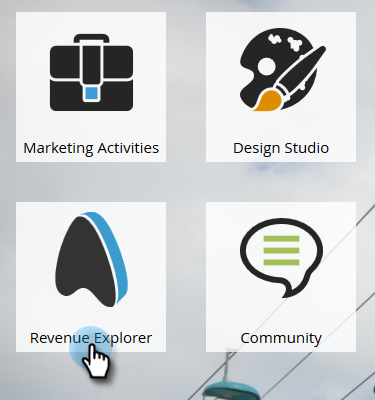
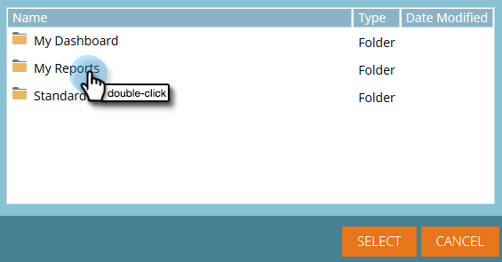
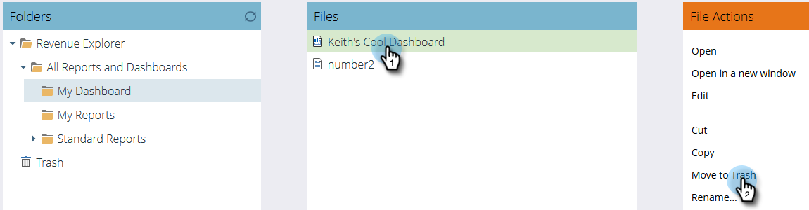

# Using Dashboards in Revenue Explorer {#using-dashboards-in-revenue-explorer}

Using Dashboards in Revenue Explorer - Marketo Docs - Product Documentation

A dashboard is a combination of Revenue Explorer reports to get a quick overview of your leads, campaigns, opportunities, and/or models.

### What's in this article? {#what-s-in-this-article}

[Creating a New Dashboard](#usingdashboardsinrevenueexplorer-creatinganewdashboard)  
[Editing a Dashboard](#usingdashboardsinrevenueexplorer-editingadashboard)  
[Deleting a Dashboard](#usingdashboardsinrevenueexplorer-deletingadashboard)

#### Creating a New Dashboard {#usingdashboardsinrevenueexplorer-creatinganewdashboard}

##### 1. Click Revenue Explorer. {#usingdashboardsinrevenueexplorer-clickrevenueexplorer.}

##### 2. Click Create New, then Dashboard. {#usingdashboardsinrevenueexplorer-clickcreatenew-thendashboard.}

##### 3. At the bottom of the page, Templates will be selected by default. Click the layout you want to use. "2 Column" is used here. {#usingdashboardsinrevenueexplorer-atthebottomofthepage-templateswillbeselectedbydefault.clickthelayoutyouwanttouse."2column"isusedhere.}

>[!NOTE]
>
>You can further customize your dashboard's appearance by clicking **Themes** and choosing your favorite.

##### 4. In the first section of your dashboard, click the Insert icon and select File. {#usingdashboardsinrevenueexplorer-inthefirstsectionofyourdashboard-clicktheinserticonandselectfile.}

##### 5. Double-click Revenue Explorer. {#usingdashboardsinrevenueexplorer-double-clickrevenueexplorer.}

##### 6. Double-click All Reports and Dashboards. {#usingdashboardsinrevenueexplorer-double-clickallreportsanddashboards.}

##### 7. Double-click the folder that houses the report you wish to use. {#usingdashboardsinrevenueexplorer-double-clickthefolderthathousesthereportyouwishtouse.}

##### 8. Choose your report and click Select. {#usingdashboardsinrevenueexplorer-chooseyourreportandclickselect.}

##### 9. The report will then populate. Repeat steps 4-8 for each remaining section. {#usingdashboardsinrevenueexplorer-thereportwillthenpopulate.repeatsteps4-8foreachremainingsection.}

##### 10. To rename a section, click on it to select it, type the desired name under Title, and click Apply. Repeat for each section. {#usingdashboardsinrevenueexplorer-torenameasection-clickonittoselectit-typethedesirednameundertitle-andclickapply.repeatforeachsection.}

##### 11. To save, click the Save icon, enter a filename, double-click the Revenue Explorer folder until you get to the desired folder for your dashboard, and click Save. {#usingdashboardsinrevenueexplorer-tosave-clickthesaveicon-enterafilename-double-clicktherevenueexplorerfolderuntilyougettothedesiredfolderforyourdashboard-andclicksave.}

#### Editing a Dashboard {#usingdashboardsinrevenueexplorer-editingadashboard}

##### 1. Click Revenue Explorer. {#usingdashboardsinrevenueexplorer-clickrevenueexplorer..1}

##### 2. Double-click the Revenue Explorer folder. Navigate to where your dashboard lives. {#usingdashboardsinrevenueexplorer-double-clicktherevenueexplorerfolder.navigatetowhereyourdashboardlives.}

##### 3. Select the dashboard you wish to edit, then click Edit. {#usingdashboardsinrevenueexplorer-selectthedashboardyouwishtoedit-thenclickedit.}

#### Deleting a Dashboard {#usingdashboardsinrevenueexplorer-deletingadashboard}

##### 1. Click Revenue Explorer. {#usingdashboardsinrevenueexplorer-clickrevenueexplorer..2}

##### 2. Double-click the Revenue Explorer folder. Navigate to where your dashboard lives. {#usingdashboardsinrevenueexplorer-double-clicktherevenueexplorerfolder.navigatetowhereyourdashboardlives..1}

##### 3. Select the dashboard you wish to delete, then click Move to Trash. {#usingdashboardsinrevenueexplorer-selectthedashboardyouwishtodelete-thenclickmovetotrash.}

