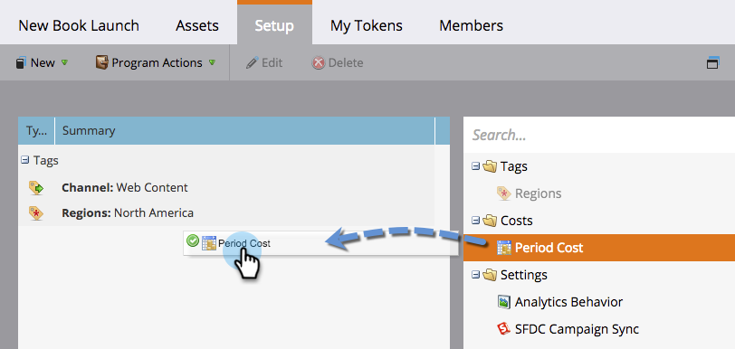
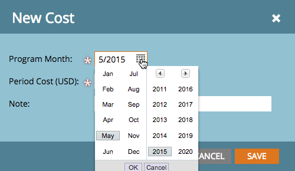

# Define Period Costs {#define-period-costs}

Define Period Costs - Marketo Docs - Product Documentation

>[!NOTE]
>
>**Definition**
>
>A period cost is the amount you spend on a program. It can be for one or more months and is used for reporting ROI.

`Track and associate lead nurturing and lead acquisition costs for a Program or Event by defining when and where you want to take costs for leads.` 

>[!NOTE]
>
>At the beginning of a Program, enter forecasted costs. Once the period in the Program completes, you can edit the Period Cost and enter in the actual cost. This will provide you with accurate reporting results.

#### Define a Period Cost {#defineperiodcosts-defineaperiodcost}

##### 1. Access the Setup tab of your Program or Event. {#defineperiodcosts-accessthesetuptabofyourprogramorevent.}

##### 2. Drag and drop Period Cost to the canvas and the New Cost dialog box displays. {#defineperiodcosts-draganddropperiodcosttothecanvasandthenewcostdialogboxdisplays.}

##### 3. Enter the Program Month you want to associate with the defined cost. {#defineperiodcosts-entertheprogrammonthyouwanttoassociatewiththedefinedcost.}

##### 4. Enter a Period Cost as a whole number without decimals or commas (max limit: 99999999) {#defineperiodcosts-enteraperiodcostasawholenumberwithoutdecimalsorcommas(maxlimit-99999999)}

>[!NOTE]
>
>The currency (e.g. USD, EUR, etc.) is a global setting managed by a Marketo Admin

##### 5. Enter a descriptive Note (optional) and click Save. {#defineperiodcosts-enteradescriptivenote(optional)andclicksave.}

#### Edit a Period Cost {#defineperiodcosts-editaperiodcost}

##### 1. Right-click the Period Cost and select Edit from the pop-up menu to open the Edit Cost dialog box. {#defineperiodcosts-right-clicktheperiodcostandselecteditfromthepop-upmenutoopentheeditcostdialogbox.}

##### 2. Edit the period cost as needed {#defineperiodcosts-edittheperiodcostasneeded}

#### Delete a Period Cost {#defineperiodcosts-deleteaperiodcost}

##### 1. Right-click the Period Cost you wish to delete and select Delete from the pop-up menu to display the Delete Cost prompt. {#defineperiodcosts-right-clicktheperiodcostyouwishtodeleteandselectdeletefromthepop-upmenutodisplaythedeletecostprompt.}

##### 2. Click Delete to permanently delete the Period Cost, or Cancel to go back. {#defineperiodcosts-clickdeletetopermanentlydeletetheperiodcost-orcanceltogoback.}

