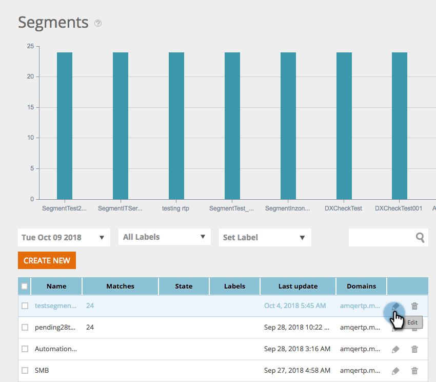
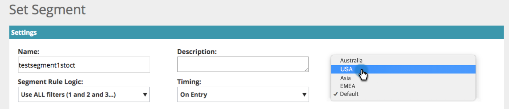

# Workspaces in Web Personalization {#workspaces-in-web-personalization}

Workspaces in Web Personalization - Marketo Docs - Product Documentation

Web Personalization supports multiple workspaces for web campaigns and web segments.

#### Switch Workspaces {#workspacesinwebpersonalization-switchworkspaces}

To switch between workspaces in web personalization, click the globe icon in the top left and choose a different workspace from the drop-down.

#### Change a Segment's Workspace {#workspacesinwebpersonalization-changeasegment'sworkspace}

##### 1. Go to the Segments page, select a segment, and click the edit icon. {#workspacesinwebpersonalization-gotothesegmentspage-selectasegment-andclicktheediticon.}

##### 2. Select a different workspace from the Workspace drop-down. {#workspacesinwebpersonalization-selectadifferentworkspacefromtheworkspacedrop-down.}

>[!NOTE]
>
>Users will only be able to see web campaigns and segments associated with the workspaces that they have access to. Here's how to [give a user access to one or more workspaces](../../../../welcome-to-marketo-docs/product-docs/administration/workspaces-and-person-partitions/allow-user-access-to-a-workspace.md).

