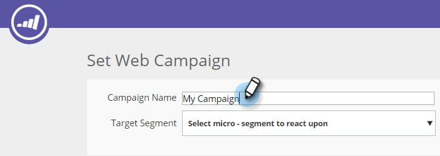
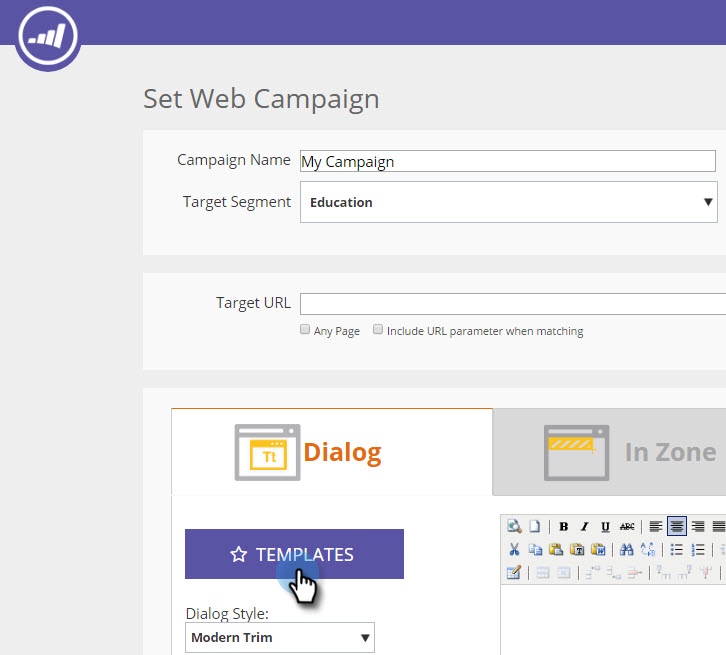

# Using Templates to Create Web Campaigns {#using-templates-to-create-web-campaigns}

Using Templates to Create Web Campaigns - Marketo Docs - Product Documentation

Speed up and simplify your web campaign creation process by using our built in templates or by [saving your own](save-your-campaign-as-a-template.md).

>[!NOTE]
>
>Templates are optimized for all devices and browsing experiences for both desktop and mobile.

##### 1. Go to Web Campaigns. {#usingtemplatestocreatewebcampaigns-gotowebcampaigns.}

  

##### 2. Click Create New Web Campaign. {#usingtemplatestocreatewebcampaigns-clickcreatenewwebcampaign.}

  

##### 3. Name your campaign. {#usingtemplatestocreatewebcampaigns-nameyourcampaign.}

  

##### 4. Select a Target Segment. {#usingtemplatestocreatewebcampaigns-selectatargetsegment.}

##### 5. Click Templates. {#usingtemplatestocreatewebcampaigns-clicktemplates.}

##### 6. Select the appropriate area for your campaign to see and select a template that works for you. {#usingtemplatestocreatewebcampaigns-selecttheappropriateareaforyourcampaigntoseeandselectatemplatethatworksforyou.}

>[!NOTE]
>
>**Reminder**
>
>There are some cool templates to choose from, and we will add more in the future.

>[!TIP]
>
>`For mobile campaigns select a template from the **mobile**` `section.`

##### 7. Customize the template. {#usingtemplatestocreatewebcampaigns-customizethetemplate.}

  

##### 8. Click Save. {#usingtemplatestocreatewebcampaigns-clicksave.}

Nicely done! Did you see how much time you saved by using a template?

>[!NOTE]
>
>**Related Articles**
>
>* [Save a Campaign as a Template](save-your-campaign-as-a-template.md)
>

