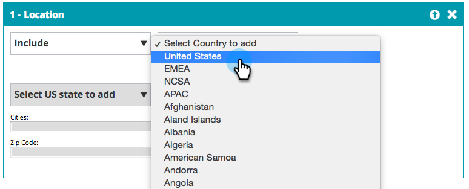
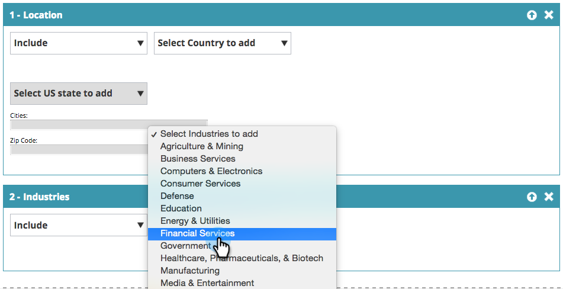

# Create a Basic Web Segment {#create-a-basic-web-segment}

Create a Basic Web Segment - Marketo Docs - Product Documentation

Let's create a basic segment targeting all web visitors from the U.S., and the financial services industry. 

##### 1. Go to Segments. {#createabasicwebsegment-gotosegments.}

##### 2. Click Create New. {#createabasicwebsegment-clickcreatenew.}

##### 3. Enter the segment name. {#createabasicwebsegment-enterthesegmentname.}

##### 4. Drag Location from the right-hand menu and drop it into the segment editor. {#createabasicwebsegment-draglocationfromtheright-handmenuanddropitintothesegmenteditor.}

##### 5. Select a country to add from the drop-down. Select the United States. {#createabasicwebsegment-selectacountrytoaddfromthedrop-down.selecttheunitedstates.}

>[!NOTE]
>
>The number of cities is limited to 300 per segment.

Now you have segmented your visitors from the United States, go ahead and add the financial services industry.  

##### 6. Drag Industries from the right-hand menu and drop it into the segment editor. {#createabasicwebsegment-dragindustriesfromtheright-handmenuanddropitintothesegmenteditor.}

##### 7. Select Industries to addfrom the drop-down. Select the Financial Services Industry. {#createabasicwebsegment-selectindustriestoaddfromthedrop-down.selectthefinancialservicesindustry.}

You have now set up a basic segment for all prospects visiting your website from the USA and the Finance Industry.

##### 8. Click Save to savethe segment or Save & Define Campaign to go to the Campaigns page. {#createabasicwebsegment-clicksavetosavethesegmentorsave&definecampaigntogotothecampaignspage.}

>[!NOTE]
>
>**Related Articles**
>
>* [Web Segments](http://docs.marketo.com/x/9QFI)
>

